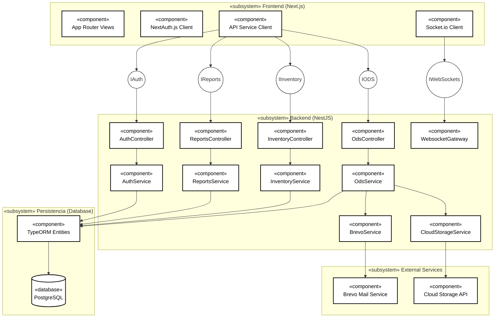
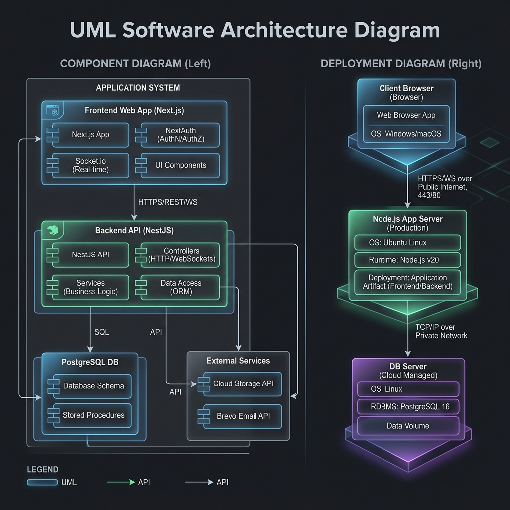

# Diagrama de Arquitectura del Proyecto (UML)

Este documento describe la arquitectura del sistema utilizando notaciones estándar UML (Lenguaje de Modelado Unificado), detallando componentes lógicos, interfaces de comunicación e infraestructura de despliegue.

---

## 1. Diagrama de Componentes (UML Component Diagram)

Este diagrama representa la estructura de software del sistema, mostrando los subsistemas de Frontend, Backend, la persistencia y los servicios externos junto a sus interfaces de comunicación.



---

## 2. Diagrama de Despliegue (UML Deployment Diagram)

Este diagrama muestra la topología del hardware y los entornos de ejecución donde se ejecutan y despliegan los artefactos de software del proyecto.

```mermaid
graph TD
    %% Deployment Diagram Styling
    classDef node fill:#eceff1,stroke:#37474f,stroke-width:2px,color:#000;
    classDef artifact fill:#ffffff,stroke:#000000,stroke-width:1px,color:#000;

    subgraph UserNode ["«device» Client Machine"]
        subgraph Browser ["«execution environment» Web Browser"]
            AppArtifact["«artifact»<br/>Next.js Static Assets & SPA"]:::artifact
        end
    end

    subgraph ServerNode ["«device» Application Server Node"]
        subgraph NodeJS ["«execution environment» Node.js Runtime"]
            NestArtifact["«artifact»<br/>NestJS Backend Application (dist/main.js)"]:::artifact
        end
    end

    subgraph DatabaseNode ["«device» Database Server"]
        subgraph PGDBMS ["«execution environment» PostgreSQL DBMS"]
            SchemaArtifact["«artifact»<br/>Relational Database Schema"]:::artifact
        end
    end

    subgraph CloudServices ["«device» Third-Party Cloud"]
        BrevoAPI["«execution environment» Brevo Mail System"]:::node
        S3Bucket["«execution environment» Object Storage (S3/Cloudinary)"]:::node
    end

    %% Connections
    Browser -->|HTTP / HTTPS (REST API) | ServerNode
    Browser -->|WebSockets (WSS)| ServerNode
    ServerNode -->|TCP / IP (Port 5432)| DatabaseNode
    ServerNode -->|HTTPS (Port 443)| CloudServices
```

---

## 3. Descripción de los Elementos UML

### A. Componentes Lógicos (Component Diagram)
- **Frontend Subsystem (Next.js)**:
  - `App Router Views`: Componentes de interfaz de usuario organizados según vistas y roles.
  - `NextAuth.js Client`: Cliente que intercepta y añade tokens de autenticación JWT.
  - `Socket.io Client`: Encargado de la comunicación bidireccional y actualización reactiva de la interfaz.
- **Backend Subsystem (NestJS)**:
  - `Controllers` (`AuthController`, `OdsController`, etc.): Puntos de entrada HTTP que exponen la API.
  - `Services` (`AuthService`, `OdsService`, etc.): Contenedores de la lógica de negocio y validación.
  - `WebsocketGateway`: Punto de entrada para la comunicación basada en eventos WebSocket.
  - `CloudStorageService` / `BrevoService`: Adaptadores encargados de interactuar con las APIs externas.

### B. Nodos y Entornos de Ejecución (Deployment Diagram)
- **Web Browser (Entorno de Ejecución)**: Hospeda los archivos estáticos HTML/JS/CSS hidratados por Next.js para ejecutar la SPA (Single Page Application) en el cliente.
- **Node.js Runtime (Servidor de Aplicaciones)**: Nodo encargado de correr el proceso del servidor NestJS (`dist/main.js`).
- **PostgreSQL DBMS (Servidor de Datos)**: Hospeda la base de datos relacional y gestiona la persistencia física de la información.
- **Third-Party Cloud**: Servicios de infraestructura SaaS y IaaS (como Brevo para envío de correos y AWS S3/Cloudinary para el almacenamiento de archivos de equipos o firmas).

---

## 4. Representación Gráfica UML (Concepto Visual)

A continuación se muestra una representación gráfica conceptual de los diagramas UML del sistema:



