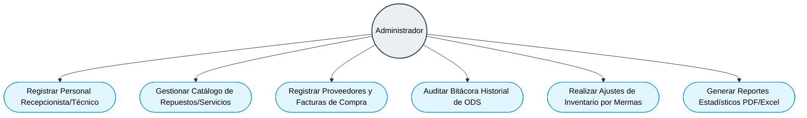
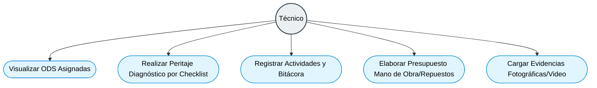
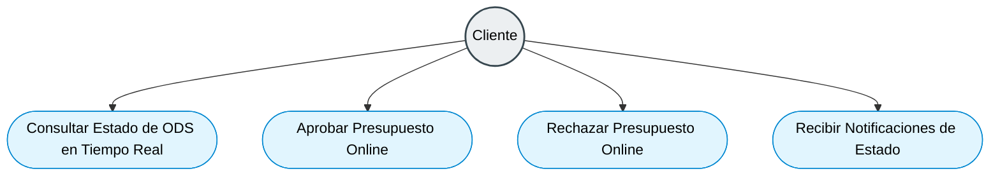
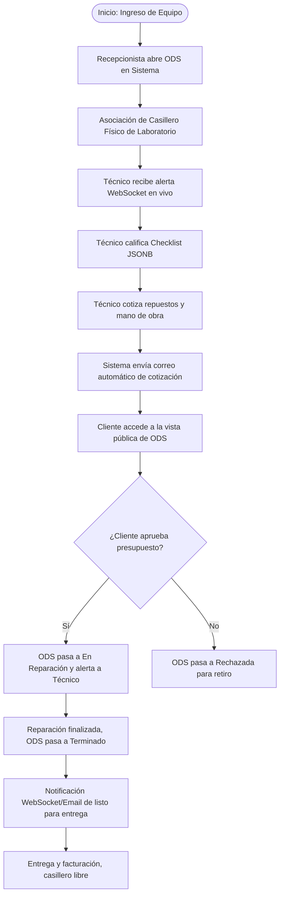

# DISEÑO VISUAL, WIREFRAMES Y DIAGRAMAS UML - HOSPITAL DEL COMPUTADOR

Este documento consolida la arquitectura visual, el diseño de la experiencia de usuario (UX/UI), el flujo lógico de interacción del sistema y el modelado físico de datos (ERD) de la aplicación de gestión de servicios desarrollada para la empresa **Hospital del Computador**.

---

## 1. DIAGRAMA ENTIDAD-RELACIÓN (ERD DE LA BASE DE DATOS)

A continuación se presenta el **Diagrama Entidad-Relación (ERD)** completo que detalla la topología de la base de datos relacional PostgreSQL de la aplicación. Muestra las interacciones, cardinalidades y restricciones de clave externa de las **29 tablas físicas** mapeadas por TypeORM en el backend:

```mermaid
erDiagram
    users {
        int id PK
        varchar cedula "UNIQUE"
        varchar nombre
        varchar apellido "NULL"
        varchar correo "UNIQUE"
        varchar telefono
        varchar direccion
        varchar ciudad
        varchar password "NULL"
        varchar resetPasswordToken "NULL"
        boolean estado
        timestamp deletedAt "NULL"
        timestamp createdAt
        timestamp updatedAt
    }
    roles {
        int id PK
        varchar nombre
        varchar slug "UNIQUE"
        varchar descripcion "NULL"
        boolean activo
        timestamp createdAt
        timestamp updatedAt
        timestamp deletedAt "NULL"
    }
    permissions {
        int id PK
        varchar nombre
        varchar slug "UNIQUE"
        varchar descripcion "NULL"
        timestamp createdAt
        timestamp updatedAt
    }
    user_roles {
        int id PK
        int userId FK
        int roleId FK
        timestamp createdAt
        timestamp updatedAt
    }
    role_permissions {
        int id PK
        int roleId FK
        int permissionId FK
        timestamp createdAt
        timestamp updatedAt
    }
    orders {
        int id PK
        varchar type
        jsonb checklistData "NULL"
        varchar workOrderNumber "UNIQUE"
        boolean estado
        int clientId FK
        int technicianId FK "NULL"
        int recepcionistaId FK "NULL"
        int equipoId FK
        varchar problemaReportado
        varchar_array accesorios "NULL"
        timestamp fechaPrometidaEntrega "NULL"
        int casilleroId FK "NULL"
        int estadoOrdenId FK "NULL"
        boolean esperaRepuesto
        float tiempoEstimadoReparacion
        timestamp createdAt
        timestamp updatedAt
        timestamp deletedAt "NULL"
    }
    equipo {
        int id PK
        varchar numeroSerie
        boolean estado
        boolean isDeleted
        int tipoEquipoId FK "NULL"
        int marcaId FK "NULL"
        int modeloId FK "NULL"
        timestamp createdAt
        timestamp updatedAt
        timestamp deletedAt "NULL"
    }
    tipoequipo {
        int id PK
        varchar nombre
        boolean estado
        timestamp createdAt
        timestamp updatedAt
        timestamp deletedAt "NULL"
    }
    marca {
        int id PK
        varchar nombre
        boolean estado
        timestamp createdAt
        timestamp updatedAt
        timestamp deletedAt "NULL"
    }
    modelo {
        int id PK
        varchar nombre
        boolean estado
        timestamp createdAt
        timestamp updatedAt
        timestamp deletedAt "NULL"
    }
    casillero {
        int id PK
        varchar codigo "UNIQUE"
        enum situacion
        varchar descripcion
        boolean estado
        int orderId FK "NULL"
        timestamp deletedAt "NULL"
        timestamp createdAt
        timestamp updatedAt
    }
    estado_orden {
        int id PK
        varchar nombre
        text descripcion "NULL"
        boolean estado
        timestamp createdAt
        timestamp updatedAt
        timestamp deletedAt "NULL"
    }
    historial_estado_orden {
        int id PK
        int ordenId FK
        int estadoAnteriorId FK "NULL"
        int estadoNuevoId FK
        int usuarioId FK
        timestamp fechaCambio
        text observaciones "NULL"
    }
    evidenciatecnica {
        int id PK
        int ordenId FK
        int subidoPorId FK
        int estadoOrdenId FK "NULL"
        text archivoUrl
        varchar tipoArchivo
        text descripcion "NULL"
        timestamp fechaSubida
        timestamp deletedAt "NULL"
    }
    actividadtecnica {
        int id PK
        int ordenId FK
        int tipoActividadId FK
        timestamp fecha
        text diagnostico
        text trabajoRealizado
        boolean estado
        timestamp deletedAt "NULL"
        timestamp createdAt
        timestamp updatedAt
    }
    tipoactividadtecnica {
        int id PK
        varchar nombre
        text descripcion "NULL"
        boolean estado
        timestamp createdAt
        timestamp updatedAt
        timestamp deletedAt "NULL"
    }
    checklist_template {
        int id PK
        varchar nombre
        int tipoEquipoId FK
        varchar_array items
        boolean estado
        timestamp createdAt
        timestamp updatedAt
        timestamp deletedAt
    }
    presupuesto {
        int id PK
        int ordenId FK "UNIQUE"
        int estadoId FK
        timestamp fechaEmision
        text descripcion "NULL"
        decimal subtotal
        decimal ivaPorcentaje
        decimal ivaMonto
        decimal total
        timestamp createdAt
        timestamp updatedAt
        timestamp deletedAt "NULL"
    }
    estadopresupuesto {
        int id PK
        varchar nombre
        text descripcion
        boolean estado
        timestamp createdAt
        timestamp updatedAt
        timestamp deletedAt "NULL"
    }
    detalle_repuestos {
        int id PK
        int cantidad
        decimal precioUnitario
        decimal subtotal
        timestamp fechaUso
        int presupuestoId FK
        int parteId FK "NULL"
        int estadoOrdenId FK "NULL"
        boolean estado
        text comentario "NULL"
        timestamp createdAt
        timestamp updatedAt
        timestamp deletedAt "NULL"
    }
    parte {
        int id PK
        varchar nombre
        varchar modelo "NULL"
        varchar descripcion "NULL"
        varchar codigoInterno "UNIQUE-NULL"
        decimal costo
        decimal precio1
        decimal precio2
        decimal precio3
        decimal precio4
        decimal ivaTarifa
        decimal stock
        decimal stockMinimo
        varchar ubicacion "NULL"
        varchar unidadMedida
        boolean permiteModificarPrecio
        boolean permiteFraccionar
        boolean estado
        int categoriaId FK
        int marcaId FK "NULL"
        timestamp createdAt
        timestamp updatedAt
        timestamp deletedAt "NULL"
    }
    categoria {
        int id PK
        varchar nombre
        boolean estado
        varchar descripcion
        timestamp createdAt
        timestamp updatedAt
        timestamp deletedAt "NULL"
    }
    compra {
        int id PK
        varchar numeroFactura
        timestamp fecha
        decimal subtotal
        decimal ivaPorcentaje
        decimal ivaMonto
        decimal total
        text comentario "NULL"
        varchar estado
        int proveedorId FK
        int usuarioId FK
        timestamp createdAt
    }
    compra_detalle {
        int id PK
        int compraId FK
        int parteId FK
        decimal cantidad
        decimal precioUnitario
        decimal subtotal
        boolean actualizarCosto
    }
    proveedor {
        int id PK
        varchar nombre
        varchar ruc_nit
        varchar correo "UNIQUE-NULL"
        varchar telefono "NULL"
        text direccion "NULL"
        boolean estado
        timestamp createdAt
        timestamp updatedAt
    }
    ajuste_inventario {
        int id PK
        timestamp fecha
        text motivo
        text comentario "NULL"
        int usuarioId FK
    }
    ajuste_inventario_detalle {
        int id PK
        int ajusteId FK
        int parteId FK
        decimal stockSistema
        decimal stockFisico
        decimal diferencia
    }
    notificaciones {
        int id PK
        int usuarioId FK
        int ordenServicioId FK "NULL"
        int tipoId FK
        text mensaje
        boolean leido
        timestamp fechaEnvio
        boolean isDeleted
        timestamp deletedAt "NULL"
    }
    tiponotificacion {
        int id PK
        varchar nombre
        text descripcion "NULL"
        boolean estado
        timestamp createdAt
        timestamp updatedAt
        timestamp deletedAt "NULL"
    }

    %% Relaciones de Identidad y Acceso
    users ||--o{ user_roles : "roles"
    roles ||--o{ user_roles : "usuarios"
    roles ||--o{ role_permissions : "permisos"
    permissions ||--o{ role_permissions : "roles"

    %% Relaciones de Órdenes y Soporte
    orders }o--|| users : "clientId (Propietario)"
    orders }o--|| users : "technicianId (Técnico)"
    orders }o--|| users : "recepcionistaId (Emisor)"
    orders }o--|| equipo : "equipoId (Hardware)"
    orders }o--o| casillero : "casilleroId (Ubicación)"
    orders }o--o| estado_orden : "estadoOrdenId"

    equipo }o--|| tipoequipo : "tipoEquipoId"
    equipo }o--|| marca : "marcaId"
    equipo }o--|| modelo : "modeloId"

    historial_estado_orden }o--|| orders : "ordenId"
    evidenciatecnica }o--|| orders : "ordenId"
    evidenciatecnica }o--|| users : "subidoPorId"
    evidenciatecnica }o--o| estado_orden : "estadoOrdenId"

    actividadtecnica }o--|| orders : "ordenId"
    actividadtecnica }o--|| tipoactividadtecnica : "tipoActividadId"

    checklist_template }o--|| tipoequipo : "tipoEquipoId"

    %% Relaciones de Presupuestos y Ventas
    presupuesto ||--|| orders : "ordenId"
    presupuesto }o--|| estadopresupuesto : "estadoId"
    presupuesto ||--o{ detalle_repuestos : "detalles"

    detalle_repuestos }o--|| parte : "parteId"
    detalle_repuestos }o--o| estado_orden : "estadoOrdenId"

    %% Relaciones de Almacén y Compras
    parte }o--|| categoria : "categoriaId"
    parte }o--|| marca : "marcaId"

    compra }o--|| proveedor : "proveedorId"
    compra }o--|| users : "usuarioId (Comprador)"
    compra ||--o{ compra_detalle : "detalles"
    compra_detalle }o--|| parte : "parteId"

    ajuste_inventario }o--|| users : "usuarioId (Auditor)"
    ajuste_inventario ||--o{ ajuste_inventario_detalle : "detalles"
    ajuste_inventario_detalle }o--|| parte : "parteId"

    %% Relaciones de Notificación
    notificaciones }o--|| users : "usuarioId"
    notificaciones }o--o| orders : "ordenServicioId"
    notificaciones }o--|| tiponotificacion : "tipoId"
```



*Fuente: Entidades del backend mapeadas por TypeORM en PostgreSQL*  
*Elaborado por: El autor, 2026*

---

## 2. DIAGRAMAS DE CASOS DE USO UML (USE CASES)

Los siguientes diagramas detallan el comportamiento del sistema y la interacción de los cuatro perfiles de usuario permitidos dentro de la plataforma web:

### 2.1 Administrador (Gestión Estratégica e Inventario)
El Administrador tiene control total sobre el catálogo de repuestos, auditorías, compras a proveedores y personal técnico y administrativo.



### 2.2 Recepcionista (Admisión y Logística)
El Recepcionista es responsable del primer contacto con el cliente, el registro del equipo, la asignación del casillero físico y la asignación del técnico encargado.

```mermaid
graph TD
    %% Styling
    classDef actor fill:#eceff1,stroke:#37474f,stroke-width:2px,color:#000;
    classDef usecase fill:#e1f5fe,stroke:#0288d1,stroke-width:1px,color:#000;

    Recep((Recepcionista)):::actor
    UC_R1([Registrar Datos de Cliente]):::usecase
    UC_R2([Apertura de Orden de Servicio ODS]):::usecase
    UC_R3([Asociar Casillero Libre a la ODS]):::usecase
    UC_R4([Asignar Técnico Encargado]):::usecase
    UC_R5([Consultar SRI API para Autocompletar]):::usecase
    
    Recep --> UC_R1
    Recep --> UC_R2
    Recep --> UC_R3
    Recep --> UC_R4
    UC_R2 ..> UC_R5 : "<< include >>"
```

### 2.3 Técnico (Laboratorio y Diagnóstico)
El Técnico realiza el diagnóstico por checklist, sube evidencias multimedia (fotos/video), consume repuestos del catálogo y genera presupuestos de reparación.



### 2.4 Cliente (Portal de Consulta Pública)
El Cliente final puede monitorear de manera asíncrona la reparación y aprobar o rechazar presupuestos directamente en la web.



---

## 3. DISEÑO UX/UI Y MAQUETACIÓN DE INTERFACES (WIREFRAMES)

El diseño de la aplicación web fue estructurado bajo principios de **Diseño Centrado en el Usuario (DCU)** y con el fin de cumplir con el nivel de accesibilidad **WCAG 2.1 nivel AA**. Para validar la disposición de los componentes y el flujo de navegación antes de proceder con la codificación en Next.js, se diseñaron wireframes esquemáticos utilizando la herramienta **Figma**.

### 3.1 Directrices y Principios del Sistema de Diseño
1. **Ratio de Contraste:** Mínimo de `4.5:1` para texto estándar e interactivo. Logrado usando una paleta base HSL de color gris pizarra oscuro (`#1e293b`) sobre fondos blancos y grises claros (`#f8fafc`).
2. **Interactividad Clara:** El cursor en foco dibuja un borde de alto contraste (`outline: 2px solid #2563eb`) para navegación por teclado.
3. **Optimización Cognitiva:** Agrupamiento de formularios y autocompletado en un paso mediante integraciones del SRI (la cédula/RUC se valida y consulta de forma síncrona en el registro).
4. **Respuestas Inmediatas:** Toasts reactivos dinámicos al cambiar estados de órdenes o cruzar límites de stock mínimos, evitando recargar la pantalla.

### 3.2 Maquetación Estructural de Interfaces (Wireframes de Baja Fidelidad)

#### A. Panel Administrativo Principal (Dashboard)
Representación de la distribución del panel del taller, integrando el Sidebar de navegación y los widgets de métricas operacionales críticas en tiempo real:

```
+---------------------------------------------------------------------------------+
| [Logo] Hospital del Computador                 |  [Alertas WebSocket] [Usuario] |
+---------------------------------------------------------------------------------+
| Sidebar Navegación |  Panel Operativo de Métricas Rápidas (Cards Reactivos)     |
|                    |  +------------------+ +------------------+ +--------------+ |
| * Órdenes (ODS)    |  | ODS Activas:  12 | | Stock Crítico: 3 | | Casil. Lib: 5| |
| * Stock Almacén    |  +------------------+ +------------------+ +--------------+ |
| * Compras          |                                                            |
| * Proveedores      |  Filtro: [ Cédula/ODS... ] [ Técnico... ]                  |
| * Reportes         |  +-------------------------------------------------------+ |
| * Personal         |  | Secuencial | Cliente   | Técnico   | Casillero| Acción| |
|                    |  |------------|-----------|-----------|----------|-------| |
|                    |  | ODS-2026-1 | Kevin U.  | Ernesto Q | CAS-03   | [Ver] | |
|                    |  | ODS-2026-2 | Pamela L. | María V.  | CAS-08   | [Ver] | |
|                    |  +-------------------------------------------------------+ |
+--------------------+------------------------------------------------------------+
```

#### B. Formulario de Peritaje Técnico (Checklist de Diagnóstico Dinámico)
Interfaz en la cual el técnico valida el hardware del dispositivo. Carga de forma dinámica la plantilla de diagnóstico asociada a la categoría (ej: Laptop, Computadora, Consola):

```
+---------------------------------------------------------------------------------+
| ODS-2026-1: Formulario de Inspección de Portátil (Técnico: Ernesto Q.)          |
+---------------------------------------------------------------------------------+
| Checklist de Diagnóstico Físico:                                                |
| [x] ¿El equipo enciende correctamente?                                           |
| [x] ¿Inicia sistema operativo instalado en disco?                               |
| [ ] ¿Falla física en bisagras o carcasa exterior?                               |
| [x] ¿Teclado físico y touchpad operativos?                                      |
| [ ] ¿Pantalla LCD libre de manchas o rayaduras?                                 |
+---------------------------------------------------------------------------------+
| Diagnóstico Escrito: "Se detecta daño leve en flex de carga y soldadura rota."  |
| Evidencias: [ Cargar Imagen JPG/PNG ] (Format: Base64 en base de datos)         |
|                                                                                 |
| [ Guardar e Ir a Presupuesto ]                          [ Cancelar Inspección ] |
+---------------------------------------------------------------------------------+
```

#### C. Portal de Consulta Pública para el Cliente (Responsive & Accesible)
Portal web público que el cliente consulta desde dispositivos móviles o computadoras sin requerir autenticación para evaluar el estado y autorizar presupuestos:

```
+---------------------------------------------------------------------------------+
| [🔍 Buscar Orden ] Cédula/RUC: [ 2300439680 ]  Secuencial ODS: [ ODS-2026-1 ]   |
+---------------------------------------------------------------------------------+
| Estado Actual de la Reparación: EN PERITAJE / PENDIENTE DE APROBACIÓN           |
| Avance General: ======================> [ 60% ]                                 |
| Observación Técnica: "Se requiere resoldar pin de carga y sustituir flex."      |
+---------------------------------------------------------------------------------+
| Detalle de Presupuesto Pautado:                                                 |
| - Sustitución de Flex de Video Portátil:        $15.00                          |
| - Mano de Obra: Soldadura SMD en Pin de Carga:  $25.00                          |
|                                                                                 |
| Subtotal: $40.00 | IVA (15%): $6.00 | TOTAL DE LA INTERVENCIÓN: $46.00          |
+---------------------------------------------------------------------------------+
| [ APROBAR REPARACIÓN (Iniciar) ]             [ RECHAZAR REPARACIÓN (Retirar) ]  |
+---------------------------------------------------------------------------------+
```

---

## 4. DIAGRAMA DE FLUJO DE INTERACCIÓN DEL USUARIO (USER FLOW)

El siguiente flujo lógico detalla el ciclo completo de la información y la interacción de los usuarios desde la recepción hasta la entrega final del dispositivo reparado:



*Fuente: Flujo de experiencia de usuario en taller (UX Flow)*  
*Elaborado por: El autor, 2026*
