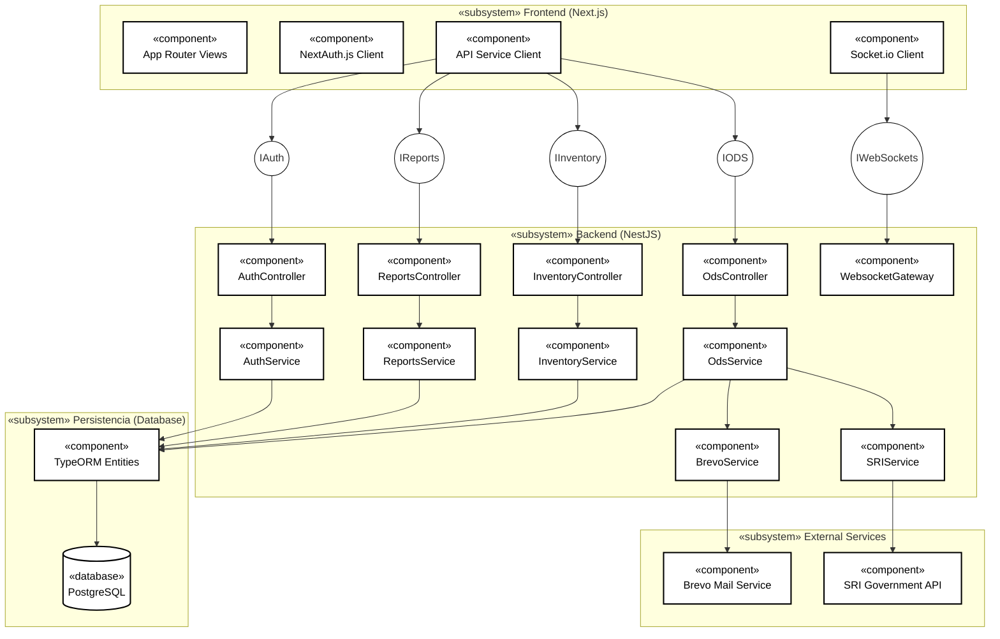

# ESCUELA SUPERIOR POLITÉCNICA DE CHIMBORAZO
## FACULTAD DE INFORMÁTICA Y ELECTRÓNICA
## CARRERA DE SOFTWARE

---

# MANUAL TÉCNICO DE SISTEMA DE SOFTWARE
## Proyecto: Desarrollo de una Aplicación Web para la Gestión de los Servicios en la Empresa “Hospital del Computador” Integrando Principios UX/UI

* **Autor:** Kevin Alexander Urbano Lombeida
* **Director:** Ing. Jorge Ariel Menéndez Verdecia
* **Institución:** Escuela Superior Politécnica de Chimborazo (ESPOCH)
* **Carrera:** Software
* **Fecha:** Riobamba, 2026

---

## 1. INTRODUCCIÓN

El presente manual técnico constituye una guía exhaustiva de ingeniería de software diseñada para detallar los aspectos de arquitectura, infraestructura física y lógica, diseño relacional de datos y planificación del **Sistema de Gestión de Servicios y Mantenimiento** desarrollado para la empresa **Hospital del Computador**, con sede en la ciudad de Riobamba, Ecuador.

El sistema ha sido estructurado bajo un patrón arquitectónico cliente-servidor desacoplado, lo que permite dividir eficientemente las responsabilidades de presentación y de negocio:
1. **Frontend (Capa de Presentación):** Desarrollado en **Next.js (App Router)** utilizando TypeScript. La interfaz de usuario incorpora principios de accesibilidad basados en las pautas **WCAG 2.1** y diseño adaptivo con **Tailwind CSS**. La sesión del usuario se gestiona de forma segura a través de **NextAuth.js** con almacenamiento seguro de tokens en cookies `HttpOnly`.
2. **Backend (Capa de Lógica de Negocio):** Implementado en **NestJS**, un framework progresivo de Node.js estructurado en módulos inyectables. Utiliza **TypeORM** como Object-Relational Mapper (ORM) para la abstracción y migración del esquema de base de datos.
3. **Persistencia (Capa de Datos):** Basada en una base de datos relacional **PostgreSQL**, optimizada para la integridad transaccional mediante restricciones físicas, claves foráneas y estrategias de borrado lógico.
4. **Servicios e Integraciones Externas:**
   * **Notificaciones en Tiempo Real:** Comunicación full-duplex bidireccional mediante **Socket.io (WebSockets)** para alertas instantáneas.
   * **Autocompletado de Clientes:** Consumo de la API externa del **Servicio de Rentas Internas (SRI)** para autocompletar la información legal de personas naturales y jurídicas a partir del número de Cédula o RUC.
   * **Notificaciones por Correo Electrónico:** Integración con la API de **Brevo** para la entrega de invitaciones de registro y restablecimiento seguro de claves.

Este manual técnico está dirigido a desarrolladores de software, administradores de bases de datos, personal de soporte tecnológico y auditores de sistemas de información, garantizando la replicabilidad, auditoría y escalabilidad del ecosistema digital del taller.

---

## 2. OBJETIVO

Proporcionar una guía metodológica, rigurosa y verificable que detalle el entorno técnico, factibilidad económica, análisis de riesgos, backlog de desarrollo y el diccionario físico de base de datos de la plataforma web de Hospital del Computador, garantizando la correcta portabilidad, auditoría de accesibilidad (WCAG 2.1) y labores de mantenimiento técnico correctivo y preventivo del software.

---

## 3. ANÁLISIS PREVIO AL DESARROLLO (FACTIBILIDAD TÉCNICA)

Para el desarrollo del proyecto, se determinaron los requisitos mínimos y recomendados de hardware y software del entorno local de desarrollo para garantizar una óptima codificación, compilación y pruebas del sistema.

### 3.1 Hardware Requerido para el Desarrollo
En la Tabla Anexo 1-A se describen las características del equipamiento físico utilizado durante el ciclo de vida del proyecto:

**Tabla Anexo 1-A: Especificación de Hardware de Desarrollo**
| Cantidad | Equipo | Marca / Procesador | Especificación Técnica |
| :---: | :--- | :--- | :--- |
| 1 | Laptop de Desarrollo | HP Ryzen 7 4800H | Procesador de 8 núcleos (2.9 GHz), 16 GB Memoria RAM DDR4, 500 GB Disco SSD NVMe. |
| 1 | Dispositivo Apuntador | Genérico Mouse | Periférico de apuntamiento ergonómico. |
| 1 | Impresora de Pruebas | Epson EcoTank L3250 | Impresora multifuncional para validación local de impresión de comprobantes ODS. |
| 1 | Teléfono Celular | Xiaomi Redmi Note 11 | Dispositivo móvil de pruebas físicas para responsividad y accesibilidad táctil. |
*Fuente: Entorno de desarrollo físico*  
*Elaborado por: El autor, 2026*

### 3.2 Software Requerido para el Desarrollo
En la Tabla Anexo 2-A se tabulan las herramientas y entornos de ejecución configurados en la estación de trabajo local:

**Tabla Anexo 2-A: Especificación de Software de Desarrollo**
| Software | Versión | Descripción y Propósito en el Ecosistema |
| :--- | :---: | :--- |
| **Windows 11 Pro 64 bits** | 23H2 | Sistema operativo base de desarrollo. |
| **TypeScript** | 5.x | Lenguaje de desarrollo fuertemente tipado para Next.js y NestJS. |
| **Next.js (App Router)** | 14.x | Framework de interfaz con renderizado en el servidor y optimizaciones. |
| **NestJS** | 10.x | Framework empresarial de Node.js para la API REST. |
| **Node.js** | 20.x | Entorno de ejecución Javascript a nivel de servidor. |
| **PostgreSQL** | 15.x | Motor de base de datos relacional para la persistencia transaccional. |
| **Visual Studio Code** | 1.85+ | Entorno de desarrollo integrado (IDE). |
| **Microsoft Office 365** | Lts | Suite de ofimática para documentación técnica. |
| **Draw.io** | 22.x | Herramienta de modelamiento de diagramas UML y BPMN. |
| **Git + GitHub** | 2.40+ | Herramientas de control de versiones distribuidas del código fuente. |
*Fuente: Entorno de desarrollo lógico*  
*Elaborado por: El autor, 2026*

### 3.3 Estándares de Codificación y Nomenclatura del Proyecto
Para garantizar la legibilidad, mantenibilidad y consistencia del código fuente tanto en el frontend como en el backend, se implementaron estándares y convenciones de nomenclatura formales de diseño de software. En la Tabla Anexo 2-B se detallan las convenciones aplicadas en el proyecto:

**Tabla Anexo 2-B: Estándares de Nomenclatura Aplicados**
| Convención | Ámbito de Aplicación | Ejemplo en el Código | Justificación y Buenas Prácticas |
| :--- | :--- | :--- | :--- |
| **PascalCase** | Nombres de clases, tipos, interfaces y componentes React. | `class EvidenciaTecnica` <br> `class Order` <br> `class User` | Convención estándar en TypeScript para la definición de tipos estructurados y componentes. |
| **camelCase** | Nombres de variables, propiedades de clases, parámetros y métodos. | `ordenId: number;` <br> `archivoUrl: string;` <br> `workOrderNumber` | Convención estándar de JavaScript para distinguir propiedades y funciones de clases y tipos base. |
| **kebab-case** | Nombres de archivos físicos, directorios y rutas de API REST. | `evidencia-tecnica.entity.ts` <br> `/api/evidencia-tecnica` | Evita discrepancias de mayúsculas/minúsculas entre sistemas de archivos locales (Windows/macOS) y servidores de producción (Linux). |
| **snake_case** | Nombre físico de tablas y columnas en la base de datos PostgreSQL. | `detalle_repuestos` <br> `historial_estado_orden` | Alineado con el estándar SQL de PostgreSQL, que es insensible a mayúsculas y utiliza guiones bajos para separación. |
| **UPPERCASE** | Variables de entorno del archivo `.env` y constantes de configuración. | `DATABASE_PORT` <br> `OrderType.EXPRESS` | Permite la rápida identificación visual de valores globales inmutables e independientes del entorno de ejecución. |
*Fuente: Entidades físicas y estructura del repositorio*  
*Elaborado por: El autor, 2026*

---

## 4. ESTUDIO DE FACTIBILIDAD ECONÓMICA

Se realizó una evaluación de los costos asociados a los recursos tecnológicos y operativos empleados durante la construcción e implantación de la aplicación web de gestión, proyectada para un periodo de desarrollo de 4 meses.

### 4.1 Costo de Recursos Técnicos (Equipos y Licencias)
En la Tabla Anexo 3-A se registran los costos ponderados y de amortización de los equipos y herramientas de desarrollo:

**Tabla Anexo 3-A: Costos de Recursos Técnicos**
| Cantidad | Descripción del Recurso | Valor Unitario | Valor Total |
| :---: | :--- | :---: | :---: |
| 1 | Laptop HP (Amortización/Uso de Desarrollo) | $500.00 | $500.00 |
| 1 | Licencia del Sistema Operativo Windows 11 | $20.00 | $20.00 |
| 1 | Servidor Local de Despliegue / Hosting de Pruebas | $80.00 | $80.00 |
| 1 | Materiales e Insumos de Oficina (Resmas, Tintas, etc.) | $50.00 | $50.00 |
| **Total** | **Recursos Técnicos** | | **$650.00** |
*Fuente: Registro contable del proyecto*  
*Elaborado por: El autor, 2026*

### 4.2 Costos Operativos Mensuales (Servicios)
En la Tabla Anexo 4-A se detallan los consumos de servicios básicos e internet fibra óptica incurridos mensualmente durante los 4 meses de implementación:

**Tabla Anexo 4-A: Costos de Servicios Operativos**
| Cantidad | Duración (Meses) | Descripción del Servicio | Costo Mensual | Valor Total |
| :---: | :---: | :--- | :---: | :---: |
| 1 | 4 | Servicios Básicos (Energía Eléctrica y Agua) | $40.00 | $160.00 |
| 1 | 4 | Servicio de Internet Fibra Óptica (Netlife) | $24.00 | $96.00 |
| **Total** | | **Servicios Operativos** | | **$256.00** |
*Fuente: Facturas de servicios de la estación de desarrollo*  
*Elaborado por: El autor, 2026*

### 4.3 Presupuesto General Consolidado
En la Tabla Anexo 5-A se unifican las cuentas de inversión técnica y operativa, representando el costo total directo del desarrollo del sistema:

**Tabla Anexo 5-A: Presupuesto General de Desarrollo**
| Código Cuenta | Rubro Ponderado | Costo Total |
| :--- | :--- | :---: |
| **CT-01** | Recursos Técnicos (Equipos, Software y Materiales) | $650.00 |
| **CT-02** | Recursos Operativos (Servicios de Conectividad y Básicos) | $256.00 |
| **TOTAL** | **PRESUPUESTO GENERAL DEL PROYECTO** | **$906.00** |
*Fuente: Presupuesto consolidado final*  
*Elaborado por: El autor, 2026*

---

## 5. PLAN DE GESTIÓN Y MITIGACIÓN DE RIESGOS

Para garantizar la viabilidad del proyecto durante su desarrollo y la alta disponibilidad de la aplicación web una vez puesta en producción, se estructuró un plan integral de gestión de riesgos dividido en dos fases: desarrollo de software y operación técnica.

### 5.1 Riesgos del Ciclo de Vida del Proyecto (Fase de Desarrollo)
En la Tabla Anexo 6-A se identifican y evalúan los riesgos de gestión y planificación de software surgidos durante las etapas de construcción, conforme al marco teórico de la tesis:

**Tabla Anexo 6-A: Matriz de Riesgos en la Fase de Desarrollo**
| Código | Riesgo Identificado | Categoría | Probabilidad | Impacto | Nivel de Riesgo |
| :---: | :--- | :--- | :---: | :---: | :---: |
| **R1** | Estimación inadecuada del tiempo del proyecto | Técnico | Alta | Alta | **Muy Alto** |
| **R2** | Priorización incorrecta de los requerimientos | Proyecto | Media | Alta | **Medio** |
| **R3** | Deficiente elicitación de requerimientos | Proyecto | Alta | Media | **Alto** |
| **R4** | Solicitudes constantes de cambios por parte del cliente | Proyecto | Alta | Alta | **Muy Alto** |
| **R5** | Información imprecisa de necesidades del cliente | Proyecto | Alta | Alta | **Alto** |
*Fuente: Planificación del proyecto de tesis*  
*Elaborado por: El autor, 2026*

Para mitigar los riesgos del ciclo de desarrollo del proyecto, se definieron las estrategias detalladas en la Tabla Anexo 7-A:

**Tabla Anexo 7-A: Estrategias de Mitigación para la Fase de Desarrollo**
| ID | Estrategia de Mitigación y Acción Preventiva |
| :---: | :--- |
| **R1** | Realizar estimación ágil utilizando Planning Poker y descomposición detallada de tareas por Sprint, revisando desviaciones de velocidad en las retrospectivas. |
| **R2** | Aplicar un método formal de priorización (MoSCoW) y validar el Backlog continuamente con el Product Owner y stakeholders en las planificaciones de Sprint. |
| **R3** | Reforzar las sesiones de elicitación mediante el diseño de prototipos visuales rápidos e iterativos en Figma para validar requerimientos antes de codificar. |
| **R4** | Establecer una política estricta de control de cambios (Change Request) firmada por Sprint, congelando el alcance una vez iniciado el Sprint Backlog. |
| **R5** | Definir criterios de aceptación en formato BDD (Dado/Cuando/Entonces) para cada historia de usuario, asegurando que el cliente entienda qué se entregará. |
*Fuente: Metodología de desarrollo del proyecto*  
*Elaborado por: El autor, 2026*

### 5.2 Riesgos de la Fase de Operación y Soporte Técnico (Puesta en Producción)
En la Tabla Anexo 8-A se listan los riesgos técnicos y logísticos detectados a nivel de ejecución del software en el taller real de Hospital del Computador:

**Tabla Anexo 8-A: Matriz de Riesgos Operativos del Sistema**
| Código | Riesgo Operativo Identificado | Categoría | Probabilidad | Impacto | Nivel de Riesgo |
| :---: | :--- | :--- | :---: | :---: | :---: |
| **RO1** | Fallas de conectividad a internet en el taller | Técnico | Media | Alta | **Alto** |
| **RO2** | Indisponibilidad o caídas de la API externa del SRI | Conectividad | Media | Media | **Medio** |
| **RO3** | Caídas o fallos críticos del servidor local de base de datos | Técnico | Baja | Alta | **Medio** |
| **RO4** | Pérdida de integridad de los datos de inventario y ODS | Datos | Baja | Alta | **Alto** |
| **RO5** | Resistencia al cambio del personal del taller (recepción/técnicos) | Operativo | Alta | Media | **Alto** |
| **RO6** | Caídas de conexión en las alertas WebSocket en tiempo real | Conectividad | Media | Baja | **Bajo** |
*Fuente: Plan de riesgos de TI del sistema*  
*Elaborado por: El autor, 2026*

Las acciones técnicas correctivas para asegurar la continuidad de las operaciones del taller se detallan en la Tabla Anexo 9-A:

**Tabla Anexo 9-A: Estrategias de Reducción y Mitigación de Riesgos Operativos**
| Código | Plan de Acción Técnica de Mitigación |
| :---: | :--- |
| **RO1** | Configurar redundancia de red a nivel de hardware (Dual-WAN) utilizando conexiones móviles 4G/5G de respaldo en la recepción del taller. |
| **RO2** | Implementar un bypass lógico en el backend: si el endpoint del SRI responde con timeout o HTTP 500, la app habilita el registro manual de clientes de forma inmediata para no detener la recepción del equipo. |
| **RO3** | Programar un servicio automatizado cron-job en el servidor local para generar respaldos comprimidos de PostgreSQL (`pg_dump`) diariamente y almacenarlos de forma redundante en discos locales e internet. |
| **RO4** | Configurar restricciones de integridad referencial física en base de datos PostgreSQL mediante claves foráneas y utilizar transacciones atómicas (`@Transaction` / `DataSource.transaction`) en TypeORM. |
| **RO5** | Impartir capacitaciones semanales en base a las interfaces UX/UI finales y entregar guías interactivas con énfasis en la simplicidad de uso de los formularios. |
| **RO6** | Implementar reconexión automática (`reconnection: true`) en el cliente de Socket.io y configurar fallbacks automáticos hacia HTTP long polling en caso de caída del puerto de WebSockets. |
*Fuente: Diseño de tolerancia a fallos del sistema*  
*Elaborado por: El autor, 2026*

La asignación de responsabilidades de auditoría y monitoreo para la fase de producción se describe en la Tabla Anexo 10-A:

**Tabla Anexo 10-A: Supervisión y Control de Riesgos Operativos**
| Código | Responsable del Monitoreo | Frecuencia de Revisión | Instrumento de Supervisión |
| :---: | :--- | :---: | :--- |
| **RO1** | Personal de Soporte Técnico | Semanal | Monitoreo de pings a la puerta de enlace e ISP logs. |
| **RO2** | Administrador de Sistemas | Mensual | Logs de excepciones HTTP y tiempos de respuesta de Axios. |
| **RO3** | Administrador de Base de Datos | Diario | Registro de ejecución de copias de seguridad de PostgreSQL. |
| **RO4** | Desarrollador de Software | Semanal | Pruebas de integración de datos y revisión de logs de TypeORM. |
| **RO5** | Gerente de la Empresa | Quincenal | Encuestas y auditorías directas de usabilidad en el taller. |
| **RO6** | Administrador de Sistemas | Bimensual | Logs de reconexión del Gateway de Socket.io en NestJS. |
*Fuente: Plan de supervisión operativa*  
*Elaborado por: El autor, 2026*

---

## 6. METODOLOGÍA SCRUM (PRODUCT BACKLOG DETALLADO)

El desarrollo del software se ejecutó mediante el marco de trabajo **Scrum**, permitiendo un desarrollo incremental y ágil estructurado en sprints.

### 6.1 Historias Técnicas Críticas (Technical Enablers)
A continuación se detallan las fichas técnicas de los habilitadores de infraestructura y arquitectura más relevantes para el cumplimiento de los requerimientos no funcionales (RNF):

**Tabla Anexo 11-A: Ficha de Historia Técnica HT-01**
| Característica | Detalle Técnico de Infraestructura |
| :--- | :--- |
| **Identificador** | **HT-01** |
| **Nombre** | Esquemas Roles/Permisos y Entidades de Base de Datos |
| **Descripción** | Diseñar, normalizar y mapear el esquema físico de base de datos en PostgreSQL e implementar las clases de entidad (`User`, `Rol`, `Permission`, `Order`, `Parte`, `Presupuesto`, `Casillero`, `Notificacion`) mediante TypeORM. |
| **Criterios de Aceptación** | 1. Estructura física creada en PostgreSQL con restricciones y llaves foráneas.<br>2. Entidades de TypeORM mapeadas e inyectadas correctamente en NestJS.<br>3. Comandos de migración y sincronización se ejecutan sin advertencias. |
| **Referencias** | RNF-03 (Arquitectura en Capas) |
| **Estimación** | 6 horas / 3 Puntos |
*Fuente: Planificación metodológica ágil*  
*Elaborado por: El autor, 2026*

**Tabla Anexo 12-A: Ficha de Historia Técnica HT-02**
| Característica | Detalle Técnico de Infraestructura |
| :--- | :--- |
| **Identificador** | **HT-02** |
| **Nombre** | Implementación de Guards de Autenticación y Autorización NestJS |
| **Descripción** | Codificar los guards globales `AuthGuard`, `RolesGuard` y `PermissionsGuard` inyectables en NestJS para interceptar las solicitudes HTTP y WebSocket a nivel de servidor. |
| **Criterios de Aceptación** | 1. Rutas protegidas bloquean peticiones que carecen de token JWT válido, devolviendo HTTP 401 Unauthorized.<br>2. Endpoints con `@RequirePermissions` restringen accesos no autorizados devolviendo HTTP 403 Forbidden.<br>3. Bypass de seguridad total para el rol Administrador. |
| **Referencias** | RNF-01 (Confidencialidad) / RNF-04 (Sanitización) |
| **Estimación** | 8 horas / 5 Puntos |
*Fuente: Planificación de seguridad*  
*Elaborado por: El autor, 2026*

**Tabla Anexo 13-A: Ficha de Historia Técnica HT-03**
| Característica | Detalle Técnico de Infraestructura |
| :--- | :--- |
| **Identificador** | **HT-03** |
| **Nombre** | Configuración de NextAuth.js en la Capa de Presentación |
| **Descripción** | Integrar NextAuth.js en el frontend Next.js mediante `CredentialsProvider`, configurando cookies seguras (`HttpOnly`, `SameSite: Lax`) para almacenar de forma persistente el token JWT del backend. |
| **Criterios de Aceptación** | 1. Inicio de sesión exitoso inyecta el token en la sesión activa del cliente.<br>2. El middleware de Next.js restringe las rutas y vistas privadas según la sesión del usuario.<br>3. Cierre de sesión remueve cookies de forma segura. |
| **Referencias** | RNF-05 (Seguridad de Sesiones en Cliente) |
| **Estimación** | 8 horas / 5 Puntos |
*Fuente: Planificación frontend*  
*Elaborado por: El autor, 2026*

**Tabla Anexo 14-A: Ficha de Historia Técnica HT-05**
| Característica | Detalle Técnico de Infraestructura |
| :--- | :--- |
| **Identificador** | **HT-05** |
| **Nombre** | Gateway WebSockets con Socket.io en Backend NestJS |
| **Descripción** | Desarrollar la infraestructura del `NotificacionGateway` en el servidor NestJS utilizando la biblioteca Socket.io, configurando el protocolo WebSockets nativo y salas por ID de usuario. |
| **Criterios de Aceptación** | 1. Comunicación bidireccional activa entre cliente y servidor.<br>2. El servidor permite unirse a salas específicas basadas en el ID de usuario autenticado.<br>3. Envío asíncrono e instantáneo de eventos de actualización. |
| **Referencias** | RNF-19 (Red en tiempo real) |
| **Estimación** | 12 horas / 8 Puntos |
*Fuente: Planificación de infraestructura en tiempo real*  
*Elaborado por: El autor, 2026*

### 6.2 Historias de Usuario Críticas (User Stories)
Se detallan las historias de usuario de mayor impacto operativo en el taller para la gestión de servicios y la relación con los clientes:

**Tabla Anexo 15-A: Ficha de Historia de Usuario HU-07**
| Característica | Detalle de Historia de Usuario |
| :--- | :--- |
| **Identificador** | **HU-07** |
| **Nombre** | Apertura y Registro de Órdenes de Servicio |
| **Descripción** | Como Recepcionista, quiero registrar una nueva orden de servicio (ODS) ingresando los datos del cliente, del equipo y la falla reportada, para dar inicio formal al proceso de soporte técnico del dispositivo. |
| **Criterios de Aceptación** | 1. Campos del cliente, equipo y problema reportado son obligatorios.<br>2. El sistema consulta a la API del SRI para autocompletar nombres/razón social a partir de cédula/RUC.<br>3. Se genera un código secuencial único `workOrderNumber` sin posibilidad de duplicidad. |
| **Referencias** | RF-07 (Ingreso ODS) / RF-18 (SRI API) |
| **Estimación** | 24 horas / 5 Puntos |
*Fuente: Backlog operativo del taller*  
*Elaborado por: El autor, 2026*

**Tabla Anexo 16-A: Ficha de Historia de Usuario HU-11**
| Característica | Detalle de Historia de Usuario |
| :--- | :--- |
| **Identificador** | **HU-11** |
| **Nombre** | Peritaje Técnico mediante Checklist Dinámico |
| **Descripción** | Como Técnico, quiero calificar los puntos de inspección específicos del equipo a través de un checklist estructurado, para guardar un diagnóstico detallado y uniforme del hardware. |
| **Criterios de Aceptación** | 1. La interfaz web renderiza automáticamente los ítems del checklist correspondientes a la categoría del dispositivo (ej: laptop, CPU, impresora).<br>2. La información del checklist se guarda como objeto serializado en formato JSONB en la base de datos.<br>3. La ODS avanza al estado "Presupuesto Pendiente". |
| **Referencias** | RF-11 (Peritaje Técnico) |
| **Estimación** | 36 horas / 8 Puntos |
*Fuente: Backlog operativo del taller*  
*Elaborado por: El autor, 2026*

**Tabla Anexo 17-A: Ficha de Historia de Usuario HU-25**
| Característica | Detalle de Historia de Usuario |
| :--- | :--- |
| **Identificador** | **HU-25** |
| **Nombre** | Generación de Presupuestos de Mantenimiento |
| **Descripción** | Como Técnico, quiero elaborar un presupuesto detallado asociando insumos del almacén y horas de servicio a la ODS, para notificar al cliente el costo del trabajo. |
| **Criterios de Aceptación** | 1. El sistema permite buscar e importar repuestos reales del inventario.<br>2. El sistema calcula automáticamente subtotales, IVA y total general.<br>3. Se guarda el presupuesto en estado "Pendiente de aprobación" asociado a la orden. |
| **Referencias** | RF-25 (Presupuesto) |
| **Estimación** | 36 horas / 8 Puntos |
*Fuente: Backlog operativo del taller*  
*Elaborado por: El autor, 2026*

**Tabla Anexo 18-A: Ficha de Historia de Usuario HU-27**
| Característica | Detalle de Historia de Usuario |
| :--- | :--- |
| **Identificador** | **HU-27** |
| **Nombre** | Aprobación de Presupuesto en Línea |
| **Descripción** | Como Cliente final, quiero acceder a un portal web público para visualizar mi cotización detallada y aprobarla o rechazarla en línea, para autorizar los trabajos de reparación de mi dispositivo. |
| **Criterios de Aceptación** | 1. El acceso al portal es público mediante correspondencia exacta de Cédula y ODS ID.<br>2. Al hacer clic en "Aprobar", el presupuesto cambia a "Aprobado", la ODS a "Por Reparar" y se gatilla notificación WebSocket al técnico.<br>3. Al hacer clic en "Rechazar", se solicita una justificación y la orden cambia a "Rechazada". |
| **Referencias** | RF-27 (Aprobación Online) |
| **Estimación** | 24 horas / 5 Puntos |
*Fuente: Backlog operativo del taller*  
*Elaborado por: El autor, 2026*

### 6.3 Product Backlog Consolidado
En la Tabla Anexo 19-A se unifica el Backlog de Producto completo del sistema web, detallando la priorización, tipo de ítem y estimación en Story Points (Fibonacci) de las 38 historias de desarrollo, cuadrando exactamente con el backlog del taller:

**Tabla Anexo 19-A: Product Backlog Consolidado de Desarrollo**
| ID | Funcionalidad / Ítem del Backlog | Tipo | Descripción Breve del Requerimiento | Criterios de Aceptación | Prioridad | Pts |
| :--- | :--- | :--- | :--- | :--- | :--- | :---: |
| **HT-01** | Esquemas Roles/Permisos BD | Técnico | Crear tablas físicas en PostgreSQL y clases inyectables de TypeORM. | Entidades creadas e inyectadas correctamente en NestJS. | Crítica | 3 |
| **HT-02** | Guards NestJS | Técnico | Programar guards de validación de autenticación JWT y permisos. | Bloqueo automático de rutas sin token JWT o permiso. | Crítica | 5 |
| **HU-01** | Inicio de Sesión Seguro | Usuario | Autenticación con cifrado y generación de JWT en el backend. | Valida credenciales e inyecta JWT en cabeceras HTTP. | Crítica | 5 |
| **HU-04** | Protección de Rutas REST | Usuario | Restringir el acceso a los endpoints REST del backend. | Peticiones sin token devuelven HTTP 401 Unauthorized. | Crítica | 2 |
| **HU-06** | Validación Granular | Usuario | Validar permisos atómicos específicos del usuario por recurso. | Denegación HTTP 403 si falta el permiso específico. | Crítica | 5 |
| **HT-03** | Setup NextAuth.js | Técnico | Configurar NextAuth en frontend Next.js para persistir sesión. | Sesiones persistentes seguras en cookies HttpOnly. | Alta | 5 |
| **HT-07** | Seeders CLI de BD | Técnico | Crear comando CLI de poblado de base de datos de roles. | Ejecución idempotente con `npm run seed`. | Media | 3 |
| **HU-02** | Registro e Invitación | Usuario | Registro de personal por el admin con envío de correo. | Despacho de invitación automática por Brevo API. | Alta | 5 |
| **HU-03** | Recuperación de Clave | Usuario | Solicitud de link seguro para restablecer contraseña. | Enlace de restablecimiento generado con vigencia de 1h. | Media | 3 |
| **HU-05** | Asignación Multi-Rol | Usuario | Permitir la asignación de múltiples roles a un usuario. | Registro en la tabla intermedia de relaciones UserRole. | Alta | 3 |
| **HU-07** | Apertura de ODS | Usuario | Registrar nueva ODS con cliente, técnico y equipo. | Almacenamiento seguro en PostgreSQL en estado inicial. | Crítica | 5 |
| **HU-08** | Código Secuencial ODS | Usuario | Autogenerar un número correlativo único para la ODS. | Generación de `workOrderNumber` secuencial atómico. | Alta | 2 |
| **HU-09** | Priorización de Casos | Usuario | Visualizar flag de urgencia (EXPRESS) en la lista de ODS. | Listado en la interfaz ordenable según prioridad. | Media | 2 |
| **HU-10** | Declaración de Problemas | Usuario | Registrar el diagnóstico inicial y accesorios entregados. | Almacenamiento de textos y arrays de ítems físicos. | Alta | 3 |
| **HU-13** | Asignación Casilleros | Usuario | Vincular un casillero físico de taller libre a la ODS. | Validación de casillero libre para evitar cruces en taller. | Media | 3 |
| **HT-04** | Soft Delete en Entidades | Técnico | Configurar borrado lógico `@DeleteDateColumn` en TypeORM. | Registros desactivados sin eliminación física. | Media | 2 |
| **HU-11** | Peritaje Técnico JSONB | Usuario | Registrar diagnóstico mediante un checklist dinámico. | Guardado del checklist en campo serializado JSONB. | Crítica | 8 |
| **HU-12** | Bitácoras Técnicas | Usuario | Registrar notas e historial de avances de reparación. | Entradas de bitácora inmutables con autor y fecha. | Media | 3 |
| **HU-14** | Evidencias Multimedia | Usuario | Adjuntar fotos y videos al diagnóstico de la orden. | Carga y almacenamiento de evidencias para auditoría. | Alta | 5 |
| **HU-25** | Generador de Presupuestos | Usuario | Crear presupuestos desglosados de repuestos y servicios. | Cálculo automático de subtotales, IVA y total de orden. | Crítica | 8 |
| **HU-26** | Aprobación Interna | Usuario | Mudar estado de la ODS automáticamente al aprobar cotización. | Transición de ODS al estado "En Reparación" en base de datos. | Alta | 2 |
| **HU-27** | Aceptación Cliente Online | Usuario | Aprobar o rechazar el presupuesto en el portal público. | Mutación en línea y envío de WebSocket al taller. | Alta | 5 |
| **HU-15** | Auditoría de Estados | Usuario | Historial de auditoría para cambios de estado de ODS. | Registro automático de fecha, anterior, nuevo y autor. | Alta | 3 |
| **HU-18** | Consulta Pública Externa | Usuario | Consultar el estado de reparación sin iniciar sesión. | Búsqueda por correspondencia de Cédula y ODS ID. | Alta | 5 |
| **HU-19** | Catálogo de Repuestos | Usuario | CRUD de repuestos con 4 tarifas de precios de venta. | Registro de precio venta al público, mayorista y especial. | Alta | 5 |
| **HU-20** | Fraccionables y Servicios | Usuario | Clasificar insumos de almacén y permitir decimales. | Control que evita descontar stock para servicios. | Alta | 3 |
| **HU-21** | Registro de Compras | Usuario | Asentar facturas físicas de compras a proveedores. | Cálculo y desglose automático de IVA e importes. | Alta | 5 |
| **HU-22** | Abastecimiento de Stock | Usuario | Incrementar stock en inventario al registrar una compra. | Actualización matemática atómica en la tabla `parte`. | Crítica | 3 |
| **HU-23** | Anulación de Compras | Usuario | Reversar compras erróneas deduciendo el stock sumado. | Descuento automático en inventario por anulación. | Media | 5 |
| **HU-24** | Ajuste de Mermas Manual | Usuario | Registrar diferencias entre stock físico y lógico. | Guardado de auditorías y correcciones manuales de stock. | Media | 3 |
| **HT-05** | Gateway WebSockets NestJS | Técnico | Configurar el Gateway de Socket.io en el backend NestJS. | Conexión estable full-duplex y salas privadas activas. | Alta | 8 |
| **HT-06** | React Hooks para Sockets | Técnico | Crear hook `useNotificacion` en Next.js para WebSocket. | Conexión e interacción de toasts en tiempo real en la UI. | Media | 5 |
| **HU-17** | Vistas Personalizadas | Usuario | Visualizar tableros específicos según el rol del usuario. | Filtros de renderizado de ODS a nivel de vistas. | Alta | 5 |
| **HU-30** | Alertas Reactivas WebSocket | Usuario | Recepción de toasts instantáneos en pantalla sobre ODS. | Disparo dinámico del evento en la interfaz del cliente. | Media | 5 |
| **HU-31** | Monitoreo Stock Mínimo | Usuario | Alertas en vivo para administradores por bajo stock. | Notificación WebSocket inmediata si stock <= stockMinimo. | Media | 5 |
| **HU-28** | Dashboard Estadístico | Usuario | Gráficos e indicadores gerenciales dinámicos. | Queries de agregación por fecha y rangos en backend. | Media | 8 |
| **HU-29** | Reportes Exportables | Usuario | Descarga de informes tabulares de inventario y ODS. | Exportación estructurada de datos en formato PDF y Excel. | Media | 5 |
| **HU-16** | Desactivación de ODS | Usuario | Borrado lógico de órdenes inactivas o duplicadas. | Oculta la orden en el cliente ejecutando soft delete. | Baja | 2 |
*Fuente: Planificación metodológica ágil*  
*Elaborado por: El autor, 2026*

---

## 7. ARQUITECTURA DEL SISTEMA (DIAGRAMAS UML)

El sistema ha sido estructurado siguiendo estándares de modelado de software UML, garantizando la modularidad y el desacoplamiento de componentes.

### 7.1 Diagrama de Componentes UML
El Diagrama de Componentes representa la organización y las dependencias lógicas entre los diferentes subsistemas de software del proyecto (Frontend, Backend, Persistencia y Servicios Externos):



### 7.2 Diagrama de Despliegue UML
El Diagrama de Despliegue muestra la topología de hardware e infraestructura física donde residen y se ejecutan los componentes lógicos del software:

```mermaid
graph TD
    %% Deployment Diagram Styling
    classDef node fill:#eceff1,stroke:#37474f,stroke-width:2px,color:#000;
    classDef artifact fill:#ffffff,stroke:#000000,stroke-width:1px,color:#000;

    subgraph UserNode ["«device» Client Machine"]
        subgraph Browser ["«execution environment» Web Browser"]
            AppArtifact["«artifact»<br/>Next.js Static Assets & SPA"]:::artifact
        end
    end

    subgraph ServerNode ["«device» Application Server Node (Local Taller)"]
        subgraph NodeJS ["«execution environment» Node.js Runtime"]
            NestArtifact["«artifact»<br/>NestJS Backend Application (dist/main.js)"]:::artifact
        end
    end

    subgraph DatabaseNode ["«device» Database Server"]
        subgraph PGDBMS ["«execution environment» PostgreSQL DBMS"]
            SchemaArtifact["«artifact»<br/>Relational Database Schema"]:::artifact
        end
    end

    subgraph CloudServices ["«device» Third-Party Cloud"]
        BrevoAPI["«execution environment» Brevo Mail System"]:::node
        SRIAPI["«execution environment» SRI Web Services"]:::node
    end

    %% Connections
    Browser -->|HTTP / HTTPS (REST API) | ServerNode
    Browser -->|WebSockets (WSS)| ServerNode
    ServerNode -->|TCP / IP (Port 5432)| DatabaseNode
    ServerNode -->|HTTPS (Port 443)| CloudServices
```

---

## 8. DICCIONARIO DE DATOS (BASE DE DATOS RELACIONAL)

Para documentar y garantizar el entendimiento lógico del esquema relacional del Hospital del Computador, se describe cada tabla configurada en el motor **PostgreSQL** mediante entidades **TypeORM**.

> [!NOTE]
> **Consolidación de Modelos:** Para la base de datos real del sistema desarrollado, se consolidaron los catálogos y tablas del esquema conceptual de la tesis para optimizar el rendimiento y escalabilidad del negocio:
> * Los conceptos de **Repuesto** y **Servicio** se unificaron en la tabla `parte`, utilizando el atributo `unidadMedida` (con valores como `'Servicio'` o `'Unidad'`) para diferenciar bienes físicos de servicios intangibles, lo que evita la redundancia de CRUDs y simplifica la lógica de facturación.
> * Las relaciones de detalle se consolidaron físicamente en la tabla `detalle_repuestos`, la cual opera a nivel de dominio como `DetallePresupuestoItem`.
> * Se introdujeron tablas adicionales necesarias para la operación física y seguridad del taller, tales como `rol`, `permissions` (sistema de seguridad RBAC), `casilleros` (logística de ubicación física en el laboratorio de electrónica) y `notificaciones` (registro de eventos en tiempo real).

### 8.1 Tabla: `users` (Usuarios y Clientes)
Mapea la entidad de TypeORM `User`. Almacena la información de contacto y credenciales de acceso de clientes, técnicos y personal administrativo.

**Tabla Anexo 20-B: Diccionario de Datos de la Tabla `users`**
| Columna | Tipo de Dato | Llave | Nulo | Descripción y Definición del Atributo |
| :--- | :--- | :---: | :---: | :--- |
| `id` | `INT` | PK | No | Identificador único secuencial de la persona (Autoincremental). |
| `cedula` | `VARCHAR(20)` | | No | Cédula de identidad o RUC ecuatoriano de la persona (Único). |
| `nombre` | `VARCHAR(100)` | | No | Nombres y apellidos completos del usuario. |
| `correo` | `VARCHAR(150)` | | No | Dirección de correo electrónico y credencial de acceso (Único). |
| `password` | `VARCHAR(255)` | | No | Contraseña cifrada en hash robusto `bcrypt`. |
| `telefono` | `VARCHAR(20)` | | Sí | Número de teléfono o celular de contacto. |
| `direccion` | `VARCHAR(255)` | | Sí | Dirección domiciliaria del cliente o trabajador. |
| `ciudad` | `VARCHAR(100)` | | Sí | Ciudad de residencia del usuario. |
| `estado` | `BOOLEAN` | | No | Flag que determina si el usuario está activo (`default: true`). |
| `reset_password_token`| `VARCHAR(255)`| | Sí | Token temporal seguro para el restablecimiento de contraseñas. |
| `createdAt` | `TIMESTAMP` | | No | Fecha y hora de creación del registro. |
| `updatedAt` | `TIMESTAMP` | | No | Fecha y hora de la última modificación de los datos. |
| `deletedAt` | `TIMESTAMP` | | Sí | Marca de tiempo de eliminación lógica (Soft Delete). |
*Fuente: Entidad física del backend*  
*Elaborado por: El autor, 2026*

### 8.2 Tabla: `rol` (Roles de Seguridad)
Mapea la entidad `Rol`. Almacena los perfiles de usuario permitidos dentro de la plataforma.

**Tabla Anexo 21-B: Diccionario de Datos de la Tabla `rol`**
| Columna | Tipo de Dato | Llave | Nulo | Descripción y Definición del Atributo |
| :--- | :--- | :---: | :---: | :--- |
| `id` | `INT` | PK | No | Identificador único correlativo del rol. |
| `nombre` | `VARCHAR(50)` | | No | Nombre legible del rol (ej: "Administrador", "Técnico"). |
| `slug` | `VARCHAR(50)` | | No | Nombre corto identificador de validación (ej: "admin", "tecnico"). |
| `estado` | `BOOLEAN` | | No | Flag que determina si el rol está activo (`default: true`). |
*Fuente: Entidad física del backend*  
*Elaborado por: El autor, 2026*

### 8.3 Tabla: `permissions` (Permisos Granulares)
Mapea la entidad `Permission`. Almacena las acciones atómicas del sistema que pueden asignarse a los roles.

**Tabla Anexo 22-B: Diccionario de Datos de la Tabla `permissions`**
| Columna | Tipo de Dato | Llave | Nulo | Descripción y Definición del Atributo |
| :--- | :--- | :---: | :---: | :--- |
| `id` | `INT` | PK | No | Identificador único correlativo del permiso. |
| `nombre` | `VARCHAR(100)` | | No | Nombre descriptivo del permiso (ej: "Crear Órdenes de Servicio"). |
| `slug` | `VARCHAR(100)` | | No | Identificador corto para guards de control (ej: "orders.create"). |
*Fuente: Entidad física del backend*  
*Elaborado por: El autor, 2026*

### 8.4 Tabla: `orders` (Órdenes de Servicio - ODS)
Mapea la entidad `Order`. Almacena la cabecera lógica del soporte técnico y control del dispositivo.

**Tabla Anexo 23-B: Diccionario de Datos de la Tabla `orders`**
| Columna | Tipo de Dato | Llave | Nulo | Descripción y Definición del Atributo |
| :--- | :--- | :---: | :---: | :--- |
| `id` | `INT` | PK | No | Identificador único incremental de la orden de servicio. |
| `tipoOrden` | `VARCHAR(30)` | | No | Tipo de ODS (ej: "EXPRESS", "NORMAL"). |
| `checklistData` | `JSONB` | | Sí | Objeto JSON con los resultados de la lista de peritaje técnico. |
| `workOrderNumber` | `VARCHAR(50)` | | No | Código único secuencial correlativo del taller (ej: "ODS-001") (Único). |
| `estado` | `BOOLEAN` | | No | Flag que indica si la orden está activa en el sistema. |
| `clientId` | `INT` | FK | No | Referencia al usuario propietario del equipo (`users.id`). |
| `technicianId` | `INT` | FK | Sí | Referencia al técnico asignado para la reparación (`users.id`). |
| `recepcionistaId` | `INT` | FK | Sí | Referencia al recepcionista emisor de la orden (`users.id`). |
| `equipoId` | `INT` | FK | No | Referencia al equipo físico en soporte (`equipo.id`). |
| `problemaReportado`| `TEXT` | | No | Descripción de las fallas descritas por el cliente al ingresar. |
| `accesorios` | `VARCHAR[]` | | Sí | Lista simple de accesorios físicos entregados con el equipo. |
| `fechaPrometidaEntrega`| `TIMESTAMP`| | Sí | Fecha comprometida pactada con el cliente para la devolución. |
| `casilleroId` | `INT` | FK | Sí | Referencia al casillero asignado en el laboratorio (`casilleros.id`). |
| `estadoOrdenId` | `INT` | FK | Sí | Referencia al estado de flujo activo del equipo (`estado_orden.id`). |
| `esperaRepuesto` | `BOOLEAN` | | No | Flag que indica si la reparación está detenida por falta de stock. |
| `tiempoEstimadoReparacion`| `FLOAT`| | No | Duración proyectada de horas de trabajo para la reparación. |
| `createdAt` | `TIMESTAMP` | | No | Fecha de creación del registro de ODS. |
| `updatedAt` | `TIMESTAMP` | | No | Fecha del último cambio del registro. |
| `deletedAt` | `TIMESTAMP` | | Sí | Marca de borrado lógico (Soft Delete). |
*Fuente: Entidad física del backend*  
*Elaborado por: El autor, 2026*

### 8.5 Tabla: `equipo` (Dispositivos Físicos)
Mapea la entidad `Equipo`. Contiene el registro físico de los dispositivos ingresados en taller.

**Tabla Anexo 24-B: Diccionario de Datos de la Tabla `equipo`**
| Columna | Tipo de Dato | Llave | Nulo | Descripción y Definición del Atributo |
| :--- | :--- | :---: | :---: | :--- |
| `id` | `INT` | PK | No | Identificador único del dispositivo físico. |
| `numeroSerie` | `VARCHAR(100)` | | No | Número de serie de fábrica del hardware (Único). |
| `estado` | `BOOLEAN` | | No | Flag que indica si el equipo está activo en el sistema. |
| `isDeleted` | `BOOLEAN` | | No | Flag que determina si el registro ha sido marcado como borrado. |
| `tipoEquipoId` | `INT` | FK | Sí | Referencia al catálogo de tipos de equipo (`tipo_equipo.id`). |
| `marcaId` | `INT` | FK | Sí | Referencia al catálogo de marcas (`marca.id`). |
| `modeloId` | `INT` | FK | Sí | Referencia al catálogo de modelos (`modelo.id`). |
| `createdAt` | `TIMESTAMP` | | No | Fecha de creación del registro. |
| `updatedAt` | `TIMESTAMP` | | No | Fecha de actualización del registro. |
| `deletedAt` | `TIMESTAMP` | | Sí | Marca de borrado lógico (Soft Delete). |
*Fuente: Entidad física del backend*  
*Elaborado por: El autor, 2026*

### 8.6 Tabla: `presupuesto` (Cotizaciones de Servicio)
Mapea la entidad `Presupuesto`. Consolida los montos de mano de obra e insumos cotizados para la ODS.

**Tabla Anexo 25-B: Diccionario de Datos de la Tabla `presupuesto`**
| Columna | Tipo de Dato | Llave | Nulo | Descripción y Definición del Atributo |
| :--- | :--- | :---: | :---: | :--- |
| `id` | `INT` | PK | No | Identificador de base de datos único para el presupuesto. |
| `subtotal` | `DECIMAL(12,2)`| | No | Sumatoria total de los items cotizados sin impuestos. |
| `ivaPorcentaje` | `DECIMAL(5,2)` | | No | Porcentaje de IVA aplicable (ej: `15.00`). |
| `ivaMonto` | `DECIMAL(12,2)`| | No | Monto monetario resultante del cálculo de IVA del subtotal. |
| `total` | `DECIMAL(12,2)`| | No | Total del presupuesto a pagar (Subtotal + IVA Monto). |
| `estado` | `VARCHAR(30)` | | No | Estado de aceptación (ej: `"Pendiente"`, `"Aprobado"`, `"Rechazado"`). |
| `ordenId` | `INT` | FK | No | Referencia a la orden de servicio asociada (`orders.id`) (Único). |
*Fuente: Entidad física del backend*  
*Elaborado por: El autor, 2026*

### 8.7 Tabla: `parte` (Catálogo de Repuestos y Servicios)
Mapea la entidad `Parte`. Funciona como catálogo maestro unificado para repuestos e insumos físicos y servicios prestados.

**Tabla Anexo 26-B: Diccionario de Datos de la Tabla `parte`**
| Columna | Tipo de Dato | Llave | Nulo | Descripción y Definición del Atributo |
| :--- | :--- | :---: | :---: | :--- |
| `id` | `INT` | PK | No | Identificador único de catálogo de la parte o servicio. |
| `nombre` | `VARCHAR(150)` | | No | Nombre descriptivo del repuesto o servicio. |
| `modelo` | `VARCHAR(100)` | | Sí | Modelo compatible del dispositivo. |
| `descripcion` | `TEXT` | | Sí | Detalles y especificaciones adicionales. |
| `codigoInterno` | `VARCHAR(80)` | | Sí | Código de barras o SKU único interno para control de inventario. |
| `costo` | `DECIMAL(12,2)`| | No | Costo promedio de adquisición del repuesto (`default: 0.00`). |
| `precio1` | `DECIMAL(12,2)`| | No | Precio de venta 1 (Precio de Venta al Público - PVP). |
| `precio2` | `DECIMAL(12,2)`| | No | Precio de venta 2 (Mayorista). |
| `precio3` | `DECIMAL(12,2)`| | No | Precio de venta 3 (Especial). |
| `precio4` | `DECIMAL(12,2)`| | No | Precio de venta 4 (Distribuidor). |
| `ivaTarifa` | `DECIMAL(5,2)` | | No | Porcentaje de impuesto IVA asignado al ítem (ej: `15.00`). |
| `stock` | `DECIMAL(12,3)`| | No | Existencia física en almacén (3 decimales para fraccionamiento). |
| `stockMinimo` | `DECIMAL(12,3)`| | No | Cantidad de stock mínima antes de disparar alertas. |
| `ubicacion` | `VARCHAR(100)` | | Sí | Ubicación física en la percha del almacén (ej: "A1"). |
| `unidadMedida` | `VARCHAR(30)` | | No | Unidad de despacho (ej: `"Unidad"`, `"Metro"`, `"Servicio"`). |
| `permiteFraccionar`| `BOOLEAN` | | No | Flag que permite fraccionamientos decimales del ítem en facturas. |
| `estado` | `BOOLEAN` | | No | Flag que indica si la parte está habilitada en el catálogo. |
| `categoriaId` | `INT` | FK | No | Referencia al catálogo de categorías (`categoria.id`). |
| `marcaId` | `INT` | FK | Sí | Referencia al catálogo de marcas (`marca.id`). |
| `createdAt` | `TIMESTAMP` | | No | Fecha de registro de la parte. |
| `updatedAt` | `TIMESTAMP` | | No | Fecha de actualización del registro. |
| `deletedAt` | `TIMESTAMP` | | Sí | Marca de borrado lógico (Soft Delete). |
*Fuente: Entidad física del backend*  
*Elaborado por: El autor, 2026*

### 8.8 Tabla: `detalle_repuestos` (Detalle del Presupuesto)
Mapea la entidad `DetallePresupuestoItem`. Almacena los ítems específicos cargados al presupuesto de una ODS.

**Tabla Anexo 27-B: Diccionario de Datos de la Tabla `detalle_repuestos`**
| Columna | Tipo de Dato | Llave | Nulo | Descripción y Definición del Atributo |
| :--- | :--- | :---: | :---: | :--- |
| `id` | `INT` | PK | No | Identificador único incremental del detalle de la orden. |
| `cantidad` | `INT` | | No | Cantidad del ítem del catálogo inyectado en el presupuesto. |
| `precioUnitario` | `DECIMAL(10,2)`| | No | Valor unitario cobrado al momento de la cotización. |
| `subtotal` | `DECIMAL(10,2)`| | No | Monto acumulado de la línea (Cantidad x Precio Unitario). |
| `fechaUso` | `TIMESTAMP` | | No | Fecha en la que el ítem es asociado formalmente a la orden. |
| `presupuestoId` | `INT` | FK | No | Referencia al presupuesto cabecera (`presupuesto.id`). |
| `parteId` | `INT` | FK | Sí | Referencia a la parte o servicio de catálogo (`parte.id`). |
| `estadoOrdenId` | `INT` | FK | Sí | Referencia al estado en el que se usó el ítem (`estado_orden.id`). |
| `estado` | `BOOLEAN` | | No | Determina si el ítem está activo en el detalle (`default: true`). |
| `comentario` | `TEXT` | | Sí | Notas del técnico sobre la aplicación del repuesto/servicio. |
| `createdAt` | `TIMESTAMP` | | No | Fecha de creación del registro. |
| `updatedAt` | `TIMESTAMP` | | No | Fecha de modificación del registro. |
| `deletedAt` | `TIMESTAMP` | | Sí | Marca de borrado lógico (Soft Delete). |
*Fuente: Entidad física del backend*  
*Elaborado por: El autor, 2026*

### 8.9 Tabla: `casilleros` (Ubicaciones Físicas de Laboratorio)
Mapea la entidad `Casillero`. Registra las ubicaciones logísticas para clasificar físicamente los dispositivos en el taller.

**Tabla Anexo 28-B: Diccionario de Datos de la Tabla `casilleros`**
| Columna | Tipo de Dato | Llave | Nulo | Descripción y Definición del Atributo |
| :--- | :--- | :---: | :---: | :--- |
| `id` | `INT` | PK | No | Identificador único del casillero físico de laboratorio. |
| `codigo` | `VARCHAR(30)` | | No | Código visual del casillero en el estante (ej: "CAS-01") (Único). |
| `descripcion` | `VARCHAR(150)` | | Sí | Descripción de capacidad o ubicación del casillero. |
| `estado` | `VARCHAR(30)` | | No | Estado logístico (ej: `"Disponible"`, `"Ocupado"`, `"Mantenimiento"`). |
*Fuente: Entidad física del backend*  
*Elaborado por: El autor, 2026*

### 8.10 Tabla: `notificaciones` (Registro de Alertas)
Mapea la entidad `Notificacion`. Almacena las alertas generadas automáticamente y enviadas en tiempo real.

**Tabla Anexo 29-B: Diccionario de Datos de la Tabla `notificaciones`**
| Columna | Tipo de Dato | Llave | Nulo | Descripción y Definición del Atributo |
| :--- | :--- | :---: | :---: | :--- |
| `id` | `INT` | PK | No | Identificador único de la notificación en sistema. |
| `mensaje` | `TEXT` | | No | Mensaje de texto descriptivo enviado al usuario receptor. |
| `leido` | `BOOLEAN` | | No | Flag que determina si el usuario abrió la alerta (`default: false`). |
| `fechaEnvio` | `TIMESTAMP` | | No | Marca de tiempo del despacho de la alerta. |
| `usuarioId` | `INT` | FK | No | Referencia al usuario destinatario de la alerta (`users.id`). |
| `ordenServicioId`| `INT` | FK | Sí | Referencia opcional a la ODS vinculada (`orders.id`). |
| `tipoId` | `INT` | FK | No | Referencia al tipo de alerta del sistema (`tipo_notificacion.id`). |
| `isDeleted` | `BOOLEAN` | | No | Flag de borrado lógico de la alerta en la bandeja del usuario. |
*Fuente: Entidad física del backend*  
*Elaborado por: El autor, 2026*

---

## 6. ESPECIFICACIÓN DE REQUISITOS DE SOFTWARE (SRS - IEEE 830)

El análisis y diseño de requerimientos del sistema se estructuró bajo las directrices del estándar **IEEE 830** (especificación de requerimientos de software) y alineado a la norma internacional de calidad de software **ISO/IEC 25010**.

### 6.1 Requerimientos Funcionales (RF)
Los requerimientos funcionales están agrupados por módulos operativos de negocio y redactados bajo la nomenclatura técnica *"El sistema DEBE [acción] [condición]"*:

#### A. Módulo de Autenticación, Usuarios y Permisos
* **RF-01:** El sistema **DEBE** permitir a los usuarios iniciar sesión mediante sus credenciales registradas (correo electrónico y contraseña).
* **RF-02:** El sistema **DEBE** permitir a los administradores registrar nuevos usuarios y enviar de forma automática una invitación por correo electrónico para que configuren su contraseña inicial.
* **RF-03:** El sistema **DEBE** permitir el restablecimiento de contraseñas de usuarios mediante el envío de un enlace seguro con vigencia limitada por correo electrónico.
* **RF-04:** El sistema **DEBE** restringir el acceso a las rutas privadas del backend mediante la validación del token de sesión JWT (`AuthGuard`).
* **RF-05:** El sistema **DEBE** permitir a los administradores asignar uno o múltiples roles a un usuario mediante endpoints de gestión de roles de usuario.
* **RF-06:** El sistema **DEBE** comprobar de forma granular los permisos específicos (`RequirePermissions` y `PermissionsGuard`) del usuario antes de ejecutar cualquier acción de escritura o lectura protegida.

#### B. Módulo de Gestión de Órdenes de Servicio (ODS)
* **RF-07:** El sistema **DEBE** registrar nuevas órdenes de servicio asociando de forma obligatoria un Cliente, un Técnico (opcional al inicio), un Recepcionista emisor y un Equipo de cliente.
* **RF-08:** El sistema **DEBE** generar de forma automática y secuencial un código único de orden de trabajo (`workOrderNumber`).
* **RF-09:** El sistema **DEBE** clasificar las órdenes de servicio según su tipo (ej. `EXPRESS` o normales) para priorizar la cola de atención técnica.
* **RF-10:** El sistema **DEBE** registrar los accesorios entregados junto al dispositivo físico y la descripción del problema reportado por el cliente al ingresar.
* **RF-11:** El sistema **DEBE** permitir el registro del peritaje o diagnóstico del equipo mediante un formulario dinámico (`checklistData`) que guarde las verificaciones en formato JSONB.
* **RF-12:** El sistema **DEBE** permitir a los técnicos registrar bitácoras o actividades técnicas asociadas al progreso del mantenimiento.
* **RF-13:** El sistema **DEBE** permitir la asignación de un casillero físico de taller (`Casillero`) a la orden para el almacenamiento seguro y la localización del hardware.
* **RF-14:** El sistema **DEBE** permitir adjuntar evidencias técnicas (imágenes y videos) del estado del equipo, registrando el autor del archivo y el estado de la orden en el momento de la carga.
* **RF-15:** El sistema **DEBE** mantener una auditoría de cambio de estados (`HistorialEstadoOrden`) registrando la fecha, el usuario responsable, el estado de origen y el estado destino.
* **RF-16:** El sistema **DEBE** permitir la desactivación (borrado lógico) y restauración de las órdenes de servicio en el panel administrativo.
* **RF-17:** El sistema **DEBE** permitir a los técnicos y clientes autenticados consultar respectivamente sus órdenes asignadas y sus equipos en mantenimiento en vistas optimizadas.
* **RF-18:** El sistema **DEBE** proveer una pantalla de consulta pública externa para que los clientes finales verifiquen el estado de su orden sin necesidad de iniciar sesión, ingresando únicamente su Cédula/RUC y su número de ODS.

#### C. Módulo de Almacén, Inventario y Compras
* **RF-19:** El sistema **DEBE** registrar ítems de inventario o partes (`Parte`) con atributos de código interno único, marca, modelo, descripción, costo de compra, 4 niveles de precios de venta (PVP, mayorista, especial, distribuidor), porcentaje de IVA, stock disponible, stock mínimo y ubicación.
* **RF-20:** El sistema **DEBE** permitir categorizar los repuestos e indicar si permiten fraccionamiento (para mediciones decimales) o si corresponden a un servicio abstracto (sin control de stock físico).
* **RF-21:** El sistema **DEBE** registrar las adquisiciones de mercadería (`Compra`) asociando el número de factura física, proveedor, fecha de emisión, desglose de subtotal, IVA y monto total facturado.
* **RF-22:** El sistema **DEBE** incrementar automáticamente el inventario de las partes en stock al registrar de forma exitosa una compra.
* **RF-23:** El sistema **DEBE** permitir la anulación de facturas de compra, descontando automáticamente del inventario el stock adicionado originalmente.
* **RF-24:** El sistema **DEBE** permitir a los administradores registrar ajustes manuales de stock (`AjusteInventario`) por motivos de merma o auditoría física, registrando el stock del sistema, el stock real verificado y la diferencia resultante.

#### D. Módulo de Presupuestos
* **RF-25:** El sistema **DEBE** permitir generar un presupuesto económico asociado a una orden de servicio, detallando la cantidad y los costos de los repuestos y mano de obra requeridos.
* **RF-26:** El sistema **DEBE** permitir la aprobación o el rechazo del presupuesto, actualizando el estado de la orden correspondiente (ej. esperando aprobación o en reparación).
* **RF-27:** El sistema **DEBE** ofrecer al cliente una vista simplificada del resumen del presupuesto para su aceptación en línea.

#### E. Módulo de Reportes y Dashboards
* **RF-28:** El sistema **DEBE** proveer al administrador estadísticas consolidadas del negocio en un Dashboard interactivo, con filtros por rangos de fecha y periodos preestablecidos.
* **RF-29:** El sistema **DEBE** generar reportes históricos y analíticos exportables de clientes registrados, valorización de inventario, compras por rango de fecha, presupuestos y efectividad de la plantilla técnica.

#### F. Mensajería y Alertas en Tiempo Real
* **RF-30:** El sistema **DEBE** emitir alertas instantáneas a través de WebSockets cuando ocurra un evento crítico de negocio: asignación de orden a un técnico, cambio de estado de ODS, o aprobación/rechazo de presupuestos.
* **RF-31:** El sistema **DEBE** realizar un chequeo asíncrono al iniciar el backend y notificar a los administradores cuando el stock de algún repuesto físico caiga por debajo de su cantidad mínima establecida.

### 6.2 Requerimientos No Funcionales (RNF)
Los requerimientos de calidad están estructurados bajo las directrices de la norma internacional **ISO/IEC 25010**:

* **RNF-01 (Confidencialidad):** Toda la comunicación con los endpoints REST del backend (exceptuando la consulta pública de órdenes) debe requerir autenticación obligatoria mediante tokens de portador JWT (`Bearer Token`) transmitidos en la cabecera `Authorization`.
* **RNF-02 (Cifrado de Datos):** Las contraseñas almacenadas de los usuarios en la base de datos PostgreSQL deben estar cifradas mediante el algoritmo de hash seguro **bcrypt** con factor de costo estándar.
* **RNF-03 (Protección en Capas - Authorization):** El backend debe validar los privilegios de acceso en múltiples capas: validando primero el token JWT (`AuthGuard`), el rol del usuario (`RolesGuard`) y los permisos granulares asociados a la base de datos (`PermissionsGuard`).
* **RNF-04 (Sanitización y Validación):** Todas las solicitudes HTTP entrantes deben pasar por un proceso automático de validación mediante `ValidationPipe` en NestJS, removiendo parámetros extraños (`whitelist: true`) y arrojando errores controlados si se envían parámetros prohibidos (`forbidNonWhitelisted: true`).
* **RNF-05 (Seguridad de Sesiones en Cliente):** El frontend debe persistir la sesión de forma segura usando NextAuth.js, guardando el token JWT de backend de forma interna e inaccesible mediante scripts de terceros (mitigando vulnerabilidades XSS).
* **RNF-06 (Optimización de Carga):** Para evitar la latencia de red y almacenamiento en disco físico local, las evidencias técnicas se transforman a formato de datos Base64 e inline URI para almacenarse directamente en la base de datos en campos de texto optimizados.
* **RNF-07 (Paginación en Base de Datos):** Las consultas de listados masivos deben paginarse desde la consulta SQL original en base de datos (`LIMIT` y `OFFSET` gestionados por TypeORM), con restricciones duras del tamaño de página (ej. limitado estrictamente a 10, 25, 50 o 100 registros) para mitigar el consumo de memoria.
* **RNF-08 (Inicialización no Bloqueante):** Las verificaciones automáticas del sistema al iniciar (ej. chequeo de alertas de inventario) deben programarse de manera asíncrona mediante eventos de ciclo de vida (`onApplicationBootstrap`) postergando su ejecución 5 segundos para no comprometer el tiempo de encendido del servidor REST.
* **RNF-09 (Integridad Referencial y Transaccionalidad):** El sistema debe garantizar la coherencia de la base de datos PostgreSQL controlando las operaciones mediante llaves foráneas y reglas de eliminación restrictivas (`RESTRICT` en eliminación de marcas/categorías con partes asociadas).
* **RNF-10 (Tolerancia a Fallos y Auditoría):** Las órdenes de servicio y repuestos deben contar con marcas de tiempo y soporte de borrado lógico (`deletedAt` mediante `@DeleteDateColumn`) para posibilitar auditorías retrospectivas y recuperación rápida ante eliminaciones fortuitas.
* **RNF-11 (Manejo de Excepciones Unificado):** El sistema debe capturar las fallas de base de datos e internas del servidor y transformarlas a respuestas JSON con códigos de estado HTTP estándar de la industria (400, 401, 403, 404, 500) a través del motor de NestJS.
* **RNF-12 (Arquitectura Modular):** El código del backend NestJS debe diseñarse en base a módulos autocontenidos por dominio de negocio (ej. `AuthModule`, `OrdersModule`, `ParteModule`), permitiendo modificar partes específicas del software sin alterar la arquitectura general.
* **RNF-13 (Separación Estricta de Responsabilidades):** El código fuente debe apegarse al patrón de capas (Controllers, DTOs, Services, Entities) para garantizar la modularidad y mantenibilidad del sistema.
* **RNF-14 (Idempotencia y Reproducibilidad en Inicialización):** El backend debe disponer de seeders de base de datos ejecutables por consola (`npm run seed:run`) para precargar de forma reproducible los roles, permisos y estados iniciales.
* **RNF-15 (Externalización de Configuraciones):** Todas las variables dinámicas de entorno (como URL de base de datos, credenciales de correo Brevo, etc.) deben aislarse en archivos `.env` validados en el arranque global del sistema.
* **RNF-16 (Interoperabilidad REST):** La API del backend debe ser completamente interoperable y estar documentada de forma abierta bajo la especificación OpenAPI utilizando Swagger, expuesta de manera interactiva en la ruta `/api/docs`.
* **RNF-17 (Integración de Terceros para Envío de Correos):** El sistema debe interoperar con la pasarela transaccional de Brevo mediante peticiones REST autenticadas (`api-key` en cabeceras) utilizando formatos de correo HTML adaptativos.
* **RNF-18 (Integración de Terceros Gubernamental):** El sistema debe consultar de forma dinámica los registros tributarios oficiales del Servicio de Rentas Internas (SRI) de Ecuador mediante peticiones HTTP GET a sus servicios web de catastro, reduciendo el error humano al auto-poblar los datos del cliente con su Cédula/RUC.
* **RNF-19 (Compatibilidad de Red en Tiempo Real):** La comunicación en tiempo real a través de WebSockets debe forzar el transporte `'websocket'` para garantizar compatibilidad sobre proxies reversos modernos (como Nginx o Cloudflare) y minimizar latencias de reconexión.

---

## 7. METODOLOGÍA ÁGIL Y PLANIFICACIÓN SCRUM

El desarrollo del proyecto se ejecutó en base a la metodología ágil **Scrum**, descomponiendo los requerimientos de la fase de análisis en incrementos funcionales estructurados por sprints.

### 7.1 Historias Técnicas Críticas (Technical Enablers)
A continuación se detallan las fichas técnicas de los habilitadores de infraestructura y arquitectura más relevantes para el cumplimiento de los requerimientos no funcionales (RNF):

**Tabla Anexo 11-A: Ficha de Historia Técnica HT-01**
| Característica | Detalle Técnico de Infraestructura |
| :--- | :--- |
| **Identificador** | **HT-01** |
| **Nombre** | Esquemas Roles/Permisos y Entidades de Base de Datos |
| **Descripción** | Diseñar, normalizar y mapear el esquema físico de base de datos en PostgreSQL e implementar las clases de entidad (`User`, `Rol`, `Permission`, `Order`, `Parte`, `Presupuesto`, `Casillero`, `Notificacion`) mediante TypeORM. |
| **Criterios de Aceptación** | 1. Estructura física creada en PostgreSQL con restricciones y llaves foráneas.<br>2. Entidades de TypeORM mapeadas e inyectadas correctamente en NestJS.<br>3. Comandos de migración y sincronización se ejecutan sin advertencias. |
| **Referencias** | RNF-03 (Arquitectura en Capas) |
| **Estimación** | 6 horas / 3 Puntos |
*Fuente: Planificación metodológica ágil*  
*Elaborado por: El autor, 2026*

**Tabla Anexo 12-A: Ficha de Historia Técnica HT-02**
| Característica | Detalle Técnico de Infraestructura |
| :--- | :--- |
| **Identificador** | **HT-02** |
| **Nombre** | Implementación de Guards de Autenticación y Autorización NestJS |
| **Descripción** | Codificar los guards globales `AuthGuard`, `RolesGuard` y `PermissionsGuard` inyectables en NestJS para interceptar las solicitudes HTTP y WebSocket a nivel de servidor. |
| **Criterios de Aceptación** | 1. Rutas protegidas bloquean peticiones que carecen de token JWT válido, devolviendo HTTP 401 Unauthorized.<br>2. Endpoints con `@RequirePermissions` restringen accesos no autorizados devolviendo HTTP 403 Forbidden.<br>3. Bypass de seguridad total para el rol Administrador. |
| **Referencias** | RNF-01 (Confidencialidad) / RNF-04 (Sanitización) |
| **Estimación** | 8 horas / 5 Puntos |
*Fuente: Planificación de seguridad*  
*Elaborado por: El autor, 2026*

**Tabla Anexo 13-A: Ficha de Historia Técnica HT-03**
| Característica | Detalle Técnico de Infraestructura |
| :--- | :--- |
| **Identificador** | **HT-03** |
| **Nombre** | Configuración de NextAuth.js en la Capa de Presentación |
| **Descripción** | Integrar NextAuth.js en el frontend Next.js mediante `CredentialsProvider`, configurando cookies seguras (`HttpOnly`, `SameSite: Lax`) para almacenar de forma persistente el token JWT del backend. |
| **Criterios de Aceptación** | 1. Inicio de sesión exitoso inyecta el token en la sesión activa del cliente.<br>2. El middleware de Next.js restringe las rutas y vistas privadas según la sesión del usuario.<br>3. Cierre de sesión remueve cookies de forma segura. |
| **Referencias** | RNF-05 (Seguridad de Sesiones en Cliente) |
| **Estimación** | 8 horas / 5 Puntos |
*Fuente: Planificación frontend*  
*Elaborado por: El autor, 2026*

**Tabla Anexo 14-A: Ficha de Historia Técnica HT-05**
| Característica | Detalle Técnico de Infraestructura |
| :--- | :--- |
| **Identificador** | **HT-05** |
| **Nombre** | Gateway WebSockets con Socket.io en Backend NestJS |
| **Descripción** | Desarrollar la infraestructura del `NotificacionGateway` en el servidor NestJS utilizando la biblioteca Socket.io, configurando el protocolo WebSockets nativo y salas por ID de usuario. |
| **Criterios de Aceptación** | 1. Comunicación bidireccional activa entre cliente y servidor.<br>2. El servidor permite unirse a salas específicas basadas en el ID de usuario autenticado.<br>3. Envío asíncrono e instantáneo de eventos de actualización. |
| **Referencias** | RNF-19 (Red en tiempo real) |
| **Estimación** | 12 horas / 8 Puntos |
*Fuente: Planificación de infraestructura en tiempo real*  
*Elaborado por: El autor, 2026*

### 7.2 Historias de Usuario Core con Criterios de Aceptación (BDD)
A continuación se detallan las 5 Historias de Usuario críticas del flujo central del negocio con sus respectivos criterios de aceptación en formato BDD (*Behavior-Driven Development*):

#### 1️⃣ HU-01: Registro e Ingreso de ODS (EPI-02)
* **Enunciado:** **Como** Recepcionista, **quiero** registrar una nueva orden de servicio para un cliente y su equipo, detallando el problema reportado y accesorios, **para** iniciar formalmente el proceso de mantenimiento y generar un número único de trabajo.
* **Criterios de Aceptación (BDD):**
  * **Escenario 1: Creación exitosa de ODS con autocompletado gubernamental.**
    * **Dado** que el Recepcionista se encuentra autenticado en el formulario de creación de ODS,
    * **Cuando** ingresa un número de Cédula/RUC ecuatoriano del cliente,
    * **Entonces** el sistema consulta dinámicamente a la API del SRI, auto-completa el nombre/razón social del cliente, genera la orden con un código único (`workOrderNumber`) correlativo en estado "Ingresado" y le asigna el rol de Cliente al usuario.
  * **Escenario 2: Registro de accesorios entregados.**
    * **Dado** que el cliente entrega accesorios físicos con su dispositivo,
    * **Cuando** el recepcionista selecciona los accesorios en el formulario y guarda la ODS,
    * **Entonces** el sistema almacena estos ítems en formato de arreglo simple en base de datos para constancia y auditoría física al momento de la devolución.
* **Referencias:** RF-07 (Ingreso ODS) / RF-18 (SRI API)
* **Estimación:** 24 horas / 5 Puntos

#### 2️⃣ HU-02: Registro de Peritaje Técnico por Checklist (EPI-02)
* **Enunciado:** **Como** Técnico, **quiero** registrar el diagnóstico inicial (peritaje) utilizando una lista de verificación dinámica basada en la categoría del dispositivo, **para** documentar de manera uniforme el estado del hardware y sustentar el presupuesto.
* **Criterios de Aceptación (BDD):**
  * **Escenario: Llenado de checklist de diagnóstico técnico.**
    * **Dado** que el Técnico tiene asignada una ODS en estado "Diagnóstico",
    * **Cuando** accede al panel de peritaje y califica cada ítem definido en la plantilla (`ChecklistTemplate`) correspondiente al tipo de equipo (ej. Laptop, Impresora),
    * **Entonces** el sistema almacena el resultado estructurado en el campo `checklistData` (JSONB) de la base de datos y avanza la orden a estado "Presupuesto Pendiente".
* **Referencias:** RF-11 (Peritaje Técnico)
* **Estimación:** 36 horas / 8 Puntos

#### 3️⃣ HU-03: Asignación de Casillero en Taller (EPI-02)
* **Enunciado:** **Como** Recepcionista o Técnico, **quiero** asociar un casillero físico del taller a la orden de servicio, **para** saber exactamente dónde se encuentra almacenado el equipo físico durante el flujo de trabajo.
* **Criterios de Aceptación (BDD):**
  * **Escenario: Asignación de casillero libre a una orden.**
    * **Dado** que una orden de servicio está activa en taller y no tiene ubicación física asignada,
    * **Cuando** el Recepcionista asocia la ODS a un casillero con estado "Disponible",
    * **Entonces** el sistema actualiza la relación en la base de datos, marca el casillero como "Ocupado" y actualiza la información en la vista de control del taller.
* **Referencias:** RF-13 (Casillero Físico)
* **Estimación:** 12 horas / 3 Puntos

#### 4️⃣ HU-04: Cotización de Presupuestos (EPI-04)
* **Enunciado:** **Como** Técnico o Recepcionista, **quiero** registrar un presupuesto detallado que desglose repuestos del inventario y servicios de mano de obra, **para** presentarlo formalmente al cliente para su aprobación.
* **Criterios de Aceptación (BDD):**
  * **Escenario: Generación de presupuesto con cálculo de tasas.**
    * **Dado** que un equipo ha sido diagnosticado y requiere reparación,
    * **Cuando** el Técnico agrega repuestos del inventario (restando stock proyectado) o servicios al presupuesto,
    * **Entonces** el sistema debe calcular de forma automática el subtotal, los impuestos (IVA aplicable) y el total general de la cotización, registrando el presupuesto en estado "Pendiente de Aprobación".
* **Referencias:** RF-25 (Presupuesto)
* **Estimación:** 36 horas / 8 Puntos

#### 5️⃣ HU-05: Aprobación de Presupuesto por el Cliente (EPI-04)
* **Enunciado:** **Como** Cliente final, **quiero** revisar la cotización económica de la reparación de mi equipo en un portal seguro sin requerir login complejo, **para** autorizar de forma inmediata los trabajos de reparación o rechazar el servicio.
* **Criterios de Aceptación (BDD):**
  * **Escenario: Aprobación en línea del presupuesto.**
    * **Dado** que el Cliente accede a la vista pública de resumen del presupuesto,
    * **Cuando** hace clic en el botón "Aprobar Presupuesto",
    * **Entonces** el sistema cambia el estado del presupuesto a "Aprobado", avanza la orden de trabajo a estado "Por Reparar", y gatilla una notificación WebSocket en tiempo real al técnico asignado.
* **Referencias:** RF-27 (Aprobación Online)
* **Estimación:** 24 horas / 5 Puntos

### 7.3 Product Backlog Consolidado
En la Tabla Anexo 19-A se unifica el Backlog de Producto completo del sistema web, detallando la priorización, tipo de ítem y estimación en Story Points (Fibonacci) de las 38 historias de desarrollo:

**Tabla Anexo 19-A: Product Backlog Consolidado de Desarrollo**
| ID | Funcionalidad / Ítem del Backlog | Tipo | Descripción Breve del Requerimiento | Criterios de Aceptación | Prioridad | Pts |
| :--- | :--- | :--- | :--- | :--- | :--- | :---: |
| **HT-01** | Esquemas Roles/Permisos BD | Técnico | Crear tablas físicas en PostgreSQL y clases inyectables de TypeORM. | Entidades creadas e inyectadas correctamente en NestJS. | Crítica | 3 |
| **HT-02** | Guards NestJS | Técnico | Programar guards de validación de autenticación JWT y permisos. | Bloqueo automático de rutas sin token JWT o permiso. | Crítica | 5 |
| **HU-01** | Inicio de Sesión Seguro | Usuario | Autenticación con cifrado y generación de JWT en el backend. | Valida credenciales e inyecta JWT en cabeceras HTTP. | Crítica | 5 |
| **HU-04** | Protección de Rutas REST | Usuario | Restringir el acceso a los endpoints REST del backend. | Peticiones sin token devuelven HTTP 401 Unauthorized. | Crítica | 2 |
| **HU-06** | Validación Granular | Usuario | Validar permisos atómicos específicos del usuario por recurso. | Denegación HTTP 403 si falta el permiso específico. | Crítica | 5 |
| **HT-03** | Setup NextAuth.js | Técnico | Configurar NextAuth en frontend Next.js para persistir sesión. | Sesiones persistentes seguras en cookies HttpOnly. | Alta | 5 |
| **HT-07** | Seeders CLI de BD | Técnico | Crear comando CLI de poblado de base de datos de roles. | Ejecución idempotente con `npm run seed`. | Media | 3 |
| **HU-02** | Registro e Invitación | Usuario | Registro de personal por el admin con envío de correo. | Despacho de invitación automática por Brevo API. | Alta | 5 |
| **HU-03** | Recuperación de Clave | Usuario | Solicitud de link seguro para restablecer contraseña. | Enlace de restablecimiento generado con vigencia de 1h. | Media | 3 |
| **HU-05** | Asignación Multi-Rol | Usuario | Permitir la asignación de múltiples roles a un usuario. | Registro en la tabla intermedia de relaciones UserRole. | Alta | 3 |
| **HU-07** | Apertura de ODS | Usuario | Registrar nueva ODS con cliente, técnico y equipo. | Almacenamiento seguro en PostgreSQL en estado inicial. | Crítica | 5 |
| **HU-08** | Código Secuencial ODS | Usuario | Autogenerar un número correlativo único para la ODS. | Generación de `workOrderNumber` secuencial atómico. | Alta | 2 |
| **HU-09** | Priorización de Casos | Usuario | Visualizar flag de urgencia (EXPRESS) en la lista de ODS. | Listado en la interfaz ordenable según prioridad. | Media | 2 |
| **HU-10** | Declaración de Problemas | Usuario | Registrar el diagnóstico inicial y accesorios entregados. | Almacenamiento de textos y arrays de ítems físicos. | Alta | 3 |
| **HU-13** | Asignación Casilleros | Usuario | Vincular un casillero físico de taller libre a la ODS. | Validación de casillero libre para evitar cruces en taller. | Media | 3 |
| **HT-04** | Soft Delete en Entidades | Técnico | Configurar borrado lógico `@DeleteDateColumn` en TypeORM. | Registros desactivados sin eliminación física. | Media | 2 |
| **HU-11** | Peritaje Técnico JSONB | Usuario | Registrar diagnóstico mediante un checklist dinámico. | Guardado del checklist en campo serializado JSONB. | Crítica | 8 |
| **HU-12** | Bitácoras Técnicas | Usuario | Registrar notas e historial de avances de reparación. | Entradas de bitácora inmutables con autor y fecha. | Media | 3 |
| **HU-14** | Evidencias Multimedia | Usuario | Adjuntar fotos y videos al diagnóstico de la orden. | Carga y almacenamiento de evidencias para auditoría. | Alta | 5 |
| **HU-25** | Generador de Presupuestos | Usuario | Crear presupuestos desglosados de repuestos y servicios. | Cálculo automático de subtotales, IVA y total de orden. | Crítica | 8 |
| **HU-26** | Aprobación Interna | Usuario | Mudar estado de la ODS automáticamente al aprobar cotización. | Transición de ODS al estado "En Reparación" en base de datos. | Alta | 2 |
| **HU-27** | Aceptación Cliente Online | Usuario | Aprobar o rechazar el presupuesto en el portal público. | Mutación en línea y envío de WebSocket al taller. | Alta | 5 |
| **HU-15** | Auditoría de Estados | Usuario | Historial de auditoría para cambios de estado de ODS. | Registro automático de fecha, anterior, nuevo y autor. | Alta | 3 |
| **HU-18** | Consulta Pública Externa | Usuario | Consultar el estado de reparación sin iniciar sesión. | Búsqueda por correspondencia de Cédula y ODS ID. | Alta | 5 |
| **HU-19** | Catálogo de Repuestos | Usuario | CRUD de repuestos con 4 tarifas de precios de venta. | Registro de precio venta al público, mayorista y especial. | Alta | 5 |
| **HU-20** | Fraccionables y Servicios | Usuario | Clasificar insumos de almacén y permitir decimales. | Control que evita descontar stock para servicios. | Alta | 3 |
| **HU-21** | Registro de Compras | Usuario | Asentar facturas físicas de compras a proveedores. | Cálculo y desglose automático de IVA e importes. | Alta | 5 |
| **HU-22** | Abastecimiento de Stock | Usuario | Incrementar stock en inventario al registrar una compra. | Actualización matemática atómica en la tabla `parte`. | Crítica | 3 |
| **HU-23** | Anulación de Compras | Usuario | Reversar compras erróneas deduciendo el stock sumado. | Descuento automático en inventario por anulación. | Media | 5 |
| **HU-24** | Ajuste de Mermas Manual | Usuario | Registrar diferencias entre stock físico y lógico. | Guardado de auditorías y correcciones manuales de stock. | Media | 3 |
| **HT-05** | Gateway WebSockets NestJS | Técnico | Configurar el Gateway de Socket.io en el backend NestJS. | Conexión estable full-duplex y salas privadas activas. | Alta | 8 |
| **HT-06** | React Hooks para Sockets | Técnico | Crear hook `useNotificacion` en Next.js para WebSocket. | Conexión e interacción de toasts en tiempo real en la UI. | Media | 5 |
| **HU-17** | Vistas Personalizadas | Usuario | Visualizar tableros específicos según el rol del usuario. | Filtros de renderizado de ODS a nivel de vistas. | Alta | 5 |
| **HU-30** | Alertas Reactivas WebSocket | Usuario | Recepción de toasts instantáneos en pantalla sobre ODS. | Disparo dinámico del evento en la interfaz del cliente. | Media | 5 |
| **HU-31** | Monitoreo Stock Mínimo | Usuario | Alertas en vivo para administradores por bajo stock. | Notificación WebSocket inmediata si stock <= stockMinimo. | Media | 5 |
| **HU-28** | Dashboard Estadístico | Usuario | Gráficos e indicadores gerenciales dinámicos. | Queries de agregación por fecha y rangos en backend. | Media | 8 |
| **HU-29** | Reportes Exportables | Usuario | Descarga de informes tabulares de inventario y ODS. | Exportación estructurada de datos en formato PDF y Excel. | Media | 5 |
| **HU-16** | Desactivación de ODS | Usuario | Borrado lógico de órdenes inactivas o duplicadas. | Oculta la orden en el cliente ejecutando soft delete. | Baja | 2 |
*Fuente: Planificación metodológica ágil*  
*Elaborado por: El autor, 2026*

---

## 8. ARQUITECTURA DEL SISTEMA (DIAGRAMAS UML)

El sistema ha sido estructurado siguiendo estándares de modelado de software UML, garantizando la modularidad y el desacoplamiento de componentes.

### 8.1 Diagrama de Componentes UML
El Diagrama de Componentes representa la organización y las dependencias lógicas entre los diferentes subsistemas de software del proyecto (Frontend, Backend, Persistencia y Servicios Externos):


### 8.2 Diagrama de Despliegue UML
El Diagrama de Despliegue muestra la topología de hardware e infraestructura física donde residen y se ejecutan los componentes lógicos del software:

```mermaid
graph TD
    %% Deployment Diagram Styling
    classDef node fill:#eceff1,stroke:#37474f,stroke-width:2px,color:#000;
    classDef artifact fill:#ffffff,stroke:#000000,stroke-width:1px,color:#000;

    subgraph UserNode ["«device» Client Machine"]
        subgraph Browser ["«execution environment» Web Browser"]
            AppArtifact["«artifact»<br/>Next.js Static Assets & SPA"]:::artifact
        end
    end

    subgraph ServerNode ["«device» Application Server Node (Local Taller)"]
        subgraph NodeJS ["«execution environment» Node.js Runtime"]
            NestArtifact["«artifact»<br/>NestJS Backend Application (dist/main.js)"]:::artifact
        end
    end

    subgraph DatabaseNode ["«device» Database Server"]
        subgraph PGDBMS ["«execution environment» PostgreSQL DBMS"]
            SchemaArtifact["«artifact»<br/>Relational Database Schema"]:::artifact
        end
    end

    subgraph CloudServices ["«device» Third-Party Cloud"]
        BrevoAPI["«execution environment» Brevo Mail System"]:::node
        SRIAPI["«execution environment» SRI Web Services"]:::node
    end

    %% Connections
    Browser -->|HTTP / HTTPS (REST API) | ServerNode
    Browser -->|WebSockets (WSS)| ServerNode
    ServerNode -->|TCP / IP (Port 5432)| DatabaseNode
    ServerNode -->|HTTPS (Port 443)| CloudServices
```

---

## 9. DISEÑO DE INTERFACES Y EXPERIENCIA DE USUARIO (UX/UI)

En esta sección se detalla el diseño de la capa de presentación del sistema, aplicando metodologías centradas en el usuario para garantizar que la plataforma sea intuitiva, eficiente y accesible, mitigando la resistencia al cambio del personal del taller.

### 9.1 Arquitectura de la Información y Mapa del Sitio
El sistema organiza sus vistas y menús jerárquicamente según el rol del usuario autenticado, dividiendo los accesos de la siguiente manera:

```
                  [ Hospital del Computador (Frontend) ]
                                    |
            +-----------------------+-----------------------+
            |                       |                       |
      [ Recepcionista ]         [ Técnico ]          [ Administrador ]
            |                       |                       |
     - Dashboard             - Dashboard             - Dashboard (Métricas)
     - Clientes              - ODS Asignadas         - Control de Personal
     - Ingreso ODS           - Peritaje Técnico      - Catálogo Completo
     - Asignación Casillero  - Presupuestos          - Compras/Proveedores
     - Notificaciones        - Notificaciones        - Ajustes de Inventario
                                                     - Reportes/Auditoría
```

### 9.2 Principios de Diseño Visual y Accesibilidad
La interfaz web fue construida utilizando **Tailwind CSS v4** y diseñada rigurosamente bajo las pautas de accesibilidad **WCAG 2.1 (Nivel AA)**, estructurando el sistema visual mediante los siguientes parámetros extraídos directamente de la hoja de estilos global de la aplicación (`globals.css`):

1. **Tipografía del Sistema:**
   Se configuró como fuente maestra la tipografía **Outfit** (`Outfit, sans-serif`), una familia geométrica moderna y limpia que optimiza la legibilidad en pantallas de taller de alto brillo. La jerarquía tipográfica se define mediante:
   * **Títulos Principales:** Configuración `--text-title-xl` (60px, line-height 72px) o `--text-title-md` (36px).
   * **Texto de Cuerpo y Tablas:** Configuración `--text-theme-sm` (14px, line-height 20px) para conservar una densidad de información legible.
   * **Etiquetas y Leyendas:** Configuración `--text-theme-xs` (12px, line-height 18px).

2. **Paleta de Colores de Alto Contraste:**
   La gama cromática fue elegida para cumplir con la tasa de contraste del estándar AA (mínimo de **4.5:1** para texto normal), implementando:
   * **Color de Marca (Primary Brand):** Azul-Índigo profundo (`#465fff` como color principal, y `#3641f5` para hover/foco), utilizado en botones de acción y componentes activos.
   * **Fondos Limpios de Taller:** Fondo claro (`#f9fafb`) sobre el cual destaca el texto principal oscuro (`#101828` y `#1d2939`) y bordes delimitadores (`#e4e7ec`), reduciendo drásticamente la carga cognitiva de los operarios.
   * **Estados y Alertas Operativas:**
     * *Éxito / Disponible:* Verde esmeralda (`#12b76a`), indicando orden completada o stock correcto.
     * *Peligro / Rechazado / Mermas:* Rojo coral (`#f04438`), denotando presupuesto rechazado o error.
     * *Advertencia / Stock Mínimo:* Naranja de advertencia (`#f79009`), previniendo roturas de stock.

3. **Interactividad y Foco Visual:**
   Para usuarios con navegación por teclado, se inyectó un anillo de foco de alta visibilidad (`--shadow-focus-ring: 0px 0px 0px 4px rgba(70, 95, 255, 0.12)`) que envuelve de inmediato el elemento seleccionado.

### 9.3 Prototipos de Baja Fidelidad (Wireframes)
Para validar la disposición de los componentes y el flujo de navegación antes de proceder con la codificación en Next.js, se diseñaron wireframes esquemáticos utilizando la herramienta Figma. A continuación, se describen las pantallas críticas del sistema:

#### 9.3.1 Pantalla de Recepción e Ingreso de ODS
Diseñada con distribución en bloques para agilizar el registro:

```
+---------------------------------------------------------------------------------+
| [Logo] Hospital del Computador                 |  [Alertas WebSocket] [Usuario] |
+---------------------------------------------------------------------------------+
| Sidebar Navegación |  Panel Operativo de Métricas Rápidas (Cards Reactivos)     |
|                    |  +------------------+ +------------------+ +--------------+ |
| * Órdenes (ODS)    |  | ODS Activas:  12 | | Stock Crítico: 3 | | Casil. Lib: 5| |
| * Stock Almacén    |  +------------------+ +------------------+ +--------------+ |
| * Compras          |                                                            |
| * Proveedores      |  Filtro: [ Cédula/ODS... ] [ Técnico... ]                  |
| * Reportes         |  +-------------------------------------------------------+ |
| * Personal         |  | Secuencial | Cliente   | Técnico   | Casillero| Acción| |
|                    |  |------------|-----------|-----------|----------|-------| |
|                    |  | ODS-2026-1 | Kevin U.  | Ernesto Q | CAS-03   | [Ver] | |
|                    |  | ODS-2026-2 | Pamela L. | María V.  | CAS-08   | [Ver] | |
|                    |  +-------------------------------------------------------+ |
+--------------------+------------------------------------------------------------+
```

#### 9.3.2 Panel Técnico (Checklist de Peritaje Dinámico)
Agrupa las variables lógicas para reducir clics en el laboratorio de soporte:

```
+---------------------------------------------------------------------------------+
| ODS-2026-1: Formulario de Inspección de Portátil (Técnico: Ernesto Q.)          |
+---------------------------------------------------------------------------------+
| Checklist de Diagnóstico Físico:                                                |
| [x] ¿El equipo enciende correctamente?                                           |
| [x] ¿Inicia sistema operativo instalado en disco?                               |
| [ ] ¿Falla física en bisagras o carcasa exterior?                               |
| [x] ¿Teclado físico y touchpad operativos?                                      |
| [ ] ¿Pantalla LCD libre de manchas o rayaduras?                                 |
+---------------------------------------------------------------------------------+
| Diagnóstico Escrito: "Se detecta daño leve en flex de carga y soldadura rota."  |
| Evidencias: [ Cargar Imagen JPG/PNG ] (Format: Base64 en base de datos)         |
|                                                                                 |
| [ Guardar e Ir a Presupuesto ]                          [ Cancelar Inspección ] |
+---------------------------------------------------------------------------------+
```

#### 9.3.3 Portal Público de Consulta y Aprobación
Vista optimizada para dispositivos móviles orientada al cliente:

```
+---------------------------------------------------------------------------------+
| [🔍 Buscar Orden ] Cédula/RUC: [ 2300439680 ]  Secuencial ODS: [ ODS-2026-1 ]   |
+---------------------------------------------------------------------------------+
| Estado Actual de la Reparación: EN PERITAJE / PENDIENTE DE APROBACIÓN           |
| Avance General: ======================> [ 60% ]                                 |
| Observación Técnica: "Se requiere resoldar pin de carga y sustituir flex."      |
+---------------------------------------------------------------------------------+
| Detalle de Presupuesto Pautado:                                                 |
| - Sustitución de Flex de Video Portátil:        $15.00                          |
| - Mano de Obra: Soldadura SMD en Pin de Carga:  $25.00                          |
|                                                                                 |
| Subtotal: $40.00 | IVA (15%): $6.00 | TOTAL DE LA INTERVENCIÓN: $46.00          |
+---------------------------------------------------------------------------------+
| [ APROBAR REPARACIÓN (Iniciar) ]             [ RECHAZAR REPARACIÓN (Retirar) ]  |
+---------------------------------------------------------------------------------+
```

---

## 10. DICCIONARIO DE DATOS (BASE DE DATOS RELACIONAL)

La base de datos física del sistema **Hospital del Computador** está construida sobre el motor **PostgreSQL** y mapeada mediante entidades de **TypeORM**. Para la base de datos real del sistema desarrollado, se consolidaron los catálogos y tablas del esquema conceptual de la tesis para optimizar el rendimiento y escalabilidad del negocio.

A continuación se detalla la estructura física de las 10 tablas centrales del sistema:

### 10.1 Tabla: `users` (Usuarios y Clientes)
Mapea la entidad de TypeORM `User`. Almacena la información de contacto y credenciales de acceso de clientes, técnicos y personal administrativo.

**Tabla Anexo 20-B: Diccionario de Datos de la Tabla `users`**
| Columna | Tipo de Dato | Llave | Nulo | Descripción y Definición del Atributo |
| :--- | :--- | :---: | :---: | :--- |
| `id` | `INT` | PK | No | Identificador único secuencial de la persona (Autoincremental). |
| `cedula` | `VARCHAR(20)` | | No | Cédula de identidad o RUC ecuatoriano de la persona (Único). |
| `nombre` | `VARCHAR(100)` | | No | Nombres y apellidos completos del usuario. |
| `correo` | `VARCHAR(150)` | | No | Dirección de correo electrónico y credencial de acceso (Único). |
| `password` | `VARCHAR(255)` | | No | Contraseña cifrada en hash robusto `bcrypt`. |
| `telefono` | `VARCHAR(20)` | | Sí | Número de teléfono o celular de contacto. |
| `direccion` | `VARCHAR(255)` | | Sí | Dirección domiciliaria del cliente o trabajador. |
| `ciudad` | `VARCHAR(100)` | | Sí | Ciudad de residencia del usuario. |
| `estado` | `BOOLEAN` | | No | Flag que determina si el usuario está activo (`default: true`). |
| `reset_password_token`| `VARCHAR(255)`| | Sí | Token temporal seguro para el restablecimiento de contraseñas. |
| `createdAt` | `TIMESTAMP` | | No | Fecha y hora de creación del registro. |
| `updatedAt` | `TIMESTAMP` | | No | Fecha y hora de la última modificación de los datos. |
| `deletedAt` | `TIMESTAMP` | | Sí | Marca de tiempo de eliminación lógica (Soft Delete). |
*Fuente: Entidad física del backend*  
*Elaborado por: El autor, 2026*

### 10.2 Tabla: `rol` (Roles de Seguridad)
Mapea la entidad `Rol`. Almacena los perfiles de usuario permitidos dentro de la plataforma.

**Tabla Anexo 21-B: Diccionario de Datos de la Tabla `rol`**
| Columna | Tipo de Dato | Llave | Nulo | Descripción y Definición del Atributo |
| :--- | :--- | :---: | :---: | :--- |
| `id` | `INT` | PK | No | Identificador único correlativo del rol. |
| `nombre` | `VARCHAR(50)` | | No | Nombre legible del rol (ej: "Administrador", "Técnico"). |
| `slug` | `VARCHAR(50)` | | No | Nombre corto identificador de validación (ej: "admin", "tecnico"). |
| `estado` | `BOOLEAN` | | No | Flag que determina si el rol está activo (`default: true`). |
*Fuente: Entidad física del backend*  
*Elaborado por: El autor, 2026*

### 10.3 Tabla: `permissions` (Permisos Granulares)
Mapea la entidad `Permission`. Almacena las acciones atómicas del sistema que pueden asignarse a los roles.

**Tabla Anexo 22-B: Diccionario de Datos de la Tabla `permissions`**
| Columna | Tipo de Dato | Llave | Nulo | Descripción y Definición del Atributo |
| :--- | :--- | :---: | :---: | :--- |
| `id` | `INT` | PK | No | Identificador único correlativo del permiso. |
| `nombre` | `VARCHAR(100)` | | No | Nombre descriptivo del permiso (ej: "Crear Órdenes de Servicio"). |
| `slug` | `VARCHAR(100)` | | No | Identificador corto para guards de control (ej: "orders.create"). |
*Fuente: Entidad física del backend*  
*Elaborado por: El autor, 2026*

### 10.4 Tabla: `orders` (Órdenes de Servicio - ODS)
Mapea la entidad `Order`. Almacena la cabecera lógica del soporte técnico y control del dispositivo.

**Tabla Anexo 23-B: Diccionario de Datos de la Tabla `orders`**
| Columna | Tipo de Dato | Llave | Nulo | Descripción y Definición del Atributo |
| :--- | :--- | :---: | :---: | :--- |
| `id` | `INT` | PK | No | Identificador único incremental de la orden de servicio. |
| `tipoOrden` | `VARCHAR(30)` | | No | Tipo de ODS (ej: "EXPRESS", "NORMAL"). |
| `checklistData` | `JSONB` | | Sí | Objeto JSON con los resultados de la lista de peritaje técnico. |
| `workOrderNumber` | `VARCHAR(50)` | | No | Código único secuencial correlativo del taller (ej: "ODS-001") (Único). |
| `estado` | `BOOLEAN` | | No | Flag que indica si la orden está activa en el sistema. |
| `clientId` | `INT` | FK | No | Referencia al usuario propietario del equipo (`users.id`). |
| `technicianId` | `INT` | FK | Sí | Referencia al técnico asignado para la reparación (`users.id`). |
| `recepcionistaId` | `INT` | FK | Sí | Referencia al recepcionista emisor de la orden (`users.id`). |
| `equipoId` | `INT` | FK | No | Referencia al equipo físico en soporte (`equipo.id`). |
| `problemaReportado`| `TEXT` | | No | Descripción de las fallas descritas por el cliente al ingresar. |
| `accesorios` | `VARCHAR[]` | | Sí | Lista simple de accesorios físicos entregados con el equipo. |
| `fechaPrometidaEntrega`| `TIMESTAMP`| | Sí | Fecha comprometida pactada con el cliente para la devolución. |
| `casilleroId` | `INT` | FK | Sí | Referencia al casillero asignado en el laboratorio (`casilleros.id`). |
| `estadoOrdenId` | `INT` | FK | Sí | Referencia al estado de flujo activo del equipo (`estado_orden.id`). |
| `esperaRepuesto` | `BOOLEAN` | | No | Flag que indica si la reparación está detenida por falta de stock. |
| `tiempoEstimadoReparacion`| `FLOAT`| | No | Duración proyectada de horas de trabajo para la reparación. |
| `createdAt` | `TIMESTAMP` | | No | Fecha de creación del registro de ODS. |
| `updatedAt` | `TIMESTAMP` | | No | Fecha del último cambio del registro. |
| `deletedAt` | `TIMESTAMP` | | Sí | Marca de borrado lógico (Soft Delete). |
*Fuente: Entidad física del backend*  
*Elaborado por: El autor, 2026*

### 10.5 Tabla: `equipo` (Dispositivos Físicos)
Mapea la entidad `Equipo`. Contiene el registro físico de los dispositivos ingresados en taller.

**Tabla Anexo 24-B: Diccionario de Datos de la Tabla `equipo`**
| Columna | Tipo de Dato | Llave | Nulo | Descripción y Definición del Atributo |
| :--- | :--- | :---: | :---: | :--- |
| `id` | `INT` | PK | No | Identificador único del dispositivo físico. |
| `numeroSerie` | `VARCHAR(100)` | | No | Número de serie de fábrica del hardware (Único). |
| `estado` | `BOOLEAN` | | No | Flag que indica si el equipo está activo en el sistema. |
| `isDeleted` | `BOOLEAN` | | No | Flag que determina si el registro ha sido marcado como borrado. |
| `tipoEquipoId` | `INT` | FK | Sí | Referencia al catálogo de tipos de equipo (`tipo_equipo.id`). |
| `marcaId` | `INT` | FK | Sí | Referencia al catálogo de marcas (`marca.id`). |
| `modeloId` | `INT` | FK | Sí | Referencia al catálogo de modelos (`modelo.id`). |
| `createdAt` | `TIMESTAMP` | | No | Fecha de creación del registro. |
| `updatedAt` | `TIMESTAMP` | | No | Fecha de actualización del registro. |
| `deletedAt` | `TIMESTAMP` | | Sí | Marca de borrado lógico (Soft Delete). |
*Fuente: Entidad física del backend*  
*Elaborado por: El autor, 2026*

### 10.6 Tabla: `presupuesto` (Cotizaciones de Servicio)
Mapea la entidad `Presupuesto`. Consolida los montos de mano de obra e insumos cotizados para la ODS.

**Tabla Anexo 25-B: Diccionario de Datos de la Tabla `presupuesto`**
| Columna | Tipo de Dato | Llave | Nulo | Descripción y Definición del Atributo |
| :--- | :--- | :---: | :---: | :--- |
| `id` | `INT` | PK | No | Identificador de base de datos único para el presupuesto. |
| `subtotal` | `DECIMAL(12,2)`| | No | Sumatoria total de los items cotizados sin impuestos. |
| `ivaPorcentaje` | `DECIMAL(5,2)` | | No | Porcentaje de IVA aplicable (ej: `15.00`). |
| `ivaMonto` | `DECIMAL(12,2)`| | No | Monto monetario resultante del cálculo de IVA del subtotal. |
| `total` | `DECIMAL(12,2)`| | No | Total del presupuesto a pagar (Subtotal + IVA Monto). |
| `estado` | `VARCHAR(30)` | | No | Estado de aceptación (ej: `"Pendiente"`, `"Aprobado"`, `"Rechazado"`). |
| `ordenId` | `INT` | FK | No | Referencia a la orden de servicio asociada (`orders.id`) (Único). |
*Fuente: Entidad física del backend*  
*Elaborado por: El autor, 2026*

### 10.7 Tabla: `parte` (Catálogo de Repuestos y Servicios)
Mapea la entidad `Parte`. Funciona como catálogo maestro unificado para repuestos e insumos físicos y servicios prestados.

**Tabla Anexo 26-B: Diccionario de Datos de la Tabla `parte`**
| Columna | Tipo de Dato | Llave | Nulo | Descripción y Definición del Atributo |
| :--- | :--- | :---: | :---: | :--- |
| `id` | `INT` | PK | No | Identificador único de catálogo de la parte o servicio. |
| `nombre` | `VARCHAR(150)` | | No | Nombre descriptivo del repuesto o servicio. |
| `modelo` | `VARCHAR(100)` | | Sí | Modelo compatible del dispositivo. |
| `descripcion` | `TEXT` | | Sí | Detalles y especificaciones adicionales. |
| `codigoInterno` | `VARCHAR(80)` | | Sí | Código de barras o SKU único interno para control de inventario. |
| `costo` | `DECIMAL(12,2)`| | No | Costo promedio de adquisición del repuesto (`default: 0.00`). |
| `precio1` | `DECIMAL(12,2)`| | No | Precio de venta 1 (Precio de Venta al Público - PVP). |
| `precio2` | `DECIMAL(12,2)`| | No | Precio de venta 2 (Mayorista). |
| `precio3` | `DECIMAL(12,2)`| | No | Precio de venta 3 (Especial). |
| `precio4` | `DECIMAL(12,2)`| | No | Precio de venta 4 (Distribuidor). |
| `ivaTarifa` | `DECIMAL(5,2)` | | No | Porcentaje de impuesto IVA asignado al ítem (ej: `15.00`). |
| `stock` | `DECIMAL(12,3)`| | No | Existencia física en almacén (3 decimales para fraccionamiento). |
| `stockMinimo` | `DECIMAL(12,3)`| | No | Cantidad de stock mínima antes de disparar alertas. |
| `ubicacion` | `VARCHAR(100)` | | Sí | Ubicación física en la percha del almacén (ej: "A1"). |
| `unidadMedida` | `VARCHAR(30)` | | No | Unidad de despacho (ej: `"Unidad"`, `"Metro"`, `"Servicio"`). |
| `permiteFraccionar`| `BOOLEAN` | | No | Flag que permite fraccionamientos decimales del ítem en facturas. |
| `estado` | `BOOLEAN` | | No | Flag que indica si la parte está habilitada en el catálogo. |
| `categoriaId` | `INT` | FK | No | Referencia al catálogo de categorías (`categoria.id`). |
| `marcaId` | `INT` | FK | Sí | Referencia al catálogo de marcas (`marca.id`). |
| `createdAt` | `TIMESTAMP` | | No | Fecha de registro de la parte. |
| `updatedAt` | `TIMESTAMP` | | No | Fecha de actualización del registro. |
| `deletedAt` | `TIMESTAMP` | | Sí | Marca de borrado lógico (Soft Delete). |
*Fuente: Entidad física del backend*  
*Elaborado por: El autor, 2026*

### 10.8 Tabla: `detalle_repuestos` (Detalle del Presupuesto)
Mapea la entidad `DetallePresupuestoItem`. Almacena los ítems específicos cargados al presupuesto de una ODS.

**Tabla Anexo 27-B: Diccionario de Datos de la Tabla `detalle_repuestos`**
| Columna | Tipo de Dato | Llave | Nulo | Descripción y Definición del Atributo |
| :--- | :--- | :---: | :---: | :--- |
| `id` | `INT` | PK | No | Identificador único incremental del detalle de la orden. |
| `cantidad` | `INT` | | No | Cantidad del ítem del catálogo inyectado en el presupuesto. |
| `precioUnitario` | `DECIMAL(10,2)`| | No | Valor unitario cobrado al momento de la cotización. |
| `subtotal` | `DECIMAL(10,2)`| | No | Monto acumulado de la línea (Cantidad x Precio Unitario). |
| `fechaUso` | `TIMESTAMP` | | No | Fecha en la que el ítem es asociado formalmente a la orden. |
| `presupuestoId` | `INT` | FK | No | Referencia al presupuesto cabecera (`presupuesto.id`). |
| `parteId` | `INT` | FK | Sí | Referencia a la parte o servicio de catálogo (`parte.id`). |
| `estadoOrdenId` | `INT` | FK | Sí | Referencia al estado en el que se usó el ítem (`estado_orden.id`). |
| `estado` | `BOOLEAN` | | No | Determina si el ítem está activo en el detalle (`default: true`). |
| `comentario` | `TEXT` | | Sí | Notas del técnico sobre la aplicación del repuesto/servicio. |
| `createdAt` | `TIMESTAMP` | | No | Fecha de creación del registro. |
| `updatedAt` | `TIMESTAMP` | | No | Fecha de modificación del registro. |
| `deletedAt` | `TIMESTAMP` | | Sí | Marca de borrado lógico (Soft Delete). |
*Fuente: Entidad física del backend*  
*Elaborado por: El autor, 2026*

### 10.9 Tabla: `casilleros` (Ubicaciones Físicas de Laboratorio)
Mapea la entidad `Casillero`. Registra las ubicaciones logísticas para clasificar físicamente los dispositivos en el taller.

**Tabla Anexo 28-B: Diccionario de Datos de la Tabla `casilleros`**
| Columna | Tipo de Dato | Llave | Nulo | Descripción y Definición del Atributo |
| :--- | :--- | :---: | :---: | :--- |
| `id` | `INT` | PK | No | Identificador único del casillero físico de laboratorio. |
| `codigo` | `VARCHAR(30)` | | No | Código visual del casillero en el estante (ej: "CAS-01") (Único). |
| `descripcion` | `VARCHAR(150)` | | Sí | Descripción de capacidad o ubicación del casillero. |
| `estado` | `VARCHAR(30)` | | No | Estado logístico (ej: `"Disponible"`, `"Ocupado"`, `"Mantenimiento"`). |
*Fuente: Entidad física del backend*  
*Elaborado por: El autor, 2026*

### 10.10 Tabla: `notificaciones` (Registro de Alertas)
Mapea la entidad `Notificacion`. Almacena las alertas generadas automáticamente y enviadas en tiempo real.

**Tabla Anexo 29-B: Diccionario de Datos de la Tabla `notificaciones`**
| Columna | Tipo de Dato | Llave | Nulo | Descripción y Definición del Atributo |
| :--- | :--- | :---: | :---: | :--- |
| `id` | `INT` | PK | No | Identificador único de la notificación en sistema. |
| `mensaje` | `TEXT` | | No | Mensaje de texto descriptivo enviado al usuario receptor. |
| `leido` | `BOOLEAN` | | No | Flag que determina si el usuario abrió la alerta (`default: false`). |
| `fechaEnvio` | `TIMESTAMP` | | No | Marca de tiempo del despacho de la alerta. |
| `usuarioId` | `INT` | FK | No | Referencia al usuario destinatario de la alerta (`users.id`). |
| `ordenServicioId`| `INT` | FK | Sí | Referencia opcional a la ODS vinculada (`orders.id`). |
| `tipoId` | `INT` | FK | No | Referencia al tipo de alerta del sistema (`tipo_notificacion.id`). |
| `isDeleted` | `BOOLEAN` | | No | Flag de borrado lógico de la alerta en la bandeja del usuario. |
*Fuente: Entidad física del backend*  
*Elaborado por: El autor, 2026*

---

## 11. COMPLEMENTOS Y DOCUMENTACIÓN ADICIONAL

Para un análisis técnico más exhaustivo y un desglose detallado de los diagramas de ingeniería y el catálogo de datos completo, consulte los siguientes archivos independientes:

1. **Diccionario de Datos Completo (29 Tablas):**  
   👉 [Diccionario de Datos.md](file:///c:/APP2/Documentacion/Diccionario%20de%20Datos.md)  
   *Contiene la especificación física y lógica detallada de todas las tablas de persistencia en PostgreSQL.*

2. **Diagramas UML y Diseño UX/UI (Enriquecimiento Visual):**  
   👉 [Diseño Visual y Diagramas UML.md](file:///c:/APP2/Documentacion/Dise%C3%B1o%20Visual%20y%20Diagramas%20UML.md)  
   *Contiene el Diagrama Entidad-Relación (ERD) completo, los Casos de Uso UML, la maquetación de interfaces (Wireframes de baja fidelidad) y el diagrama de flujo del usuario (User Flow).*


