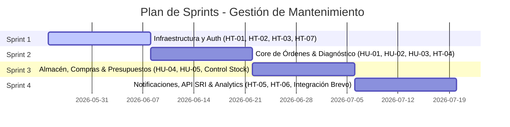

# Marco de Trabajo Ágil - Scrum Backlog & Sprint Planning
## Sistema de Gestión de Servicios y Mantenimiento (Hospital del Computador)

Este artefacto ágil define la estructuración de Épicas, Historias de Usuario (con BDD), Historias Técnicas y la planeación de Sprints para el desarrollo y seguimiento del proyecto, basándose en la ingeniería inversa del código actual.

---

## 📂 1. Product Backlog: Épicas de Negocio

| ID Épica | Nombre de la Épica | Descripción del Valor para el Negocio | Prioridad |
| :--- | :--- | :--- | :--- |
| **EPI-01** | Gestión de Identidad y Control de Acceso | **Como** administrador, quiero garantizar que cada miembro del personal acceda exclusivamente a los datos y endpoints permitidos según su rol y permisos granulares, **para** resguardar la seguridad del negocio y la integridad de la base de datos. | **Alta** |
| **EPI-02** | Gestión de Órdenes de Servicio (ODS) | **Como** recepcionista y técnico, quiero digitalizar y automatizar el ciclo de vida del ingreso, diagnóstico, reparación y entrega de los dispositivos de clientes, **para** tener trazabilidad total y eliminar el control manual en papel. | **Crítica** |
| **EPI-03** | Control de Almacén e Inventario | **Como** administrador del taller, quiero gestionar las partes y repuestos físicos, registrar compras y ajustes manuales, **para** evitar roturas de stock en el taller y conocer el costo real de los insumos. | **Alta** |
| **EPI-04** | Presupuestos y Autorizaciones en Línea | **Como** cliente final, quiero recibir una cotización desglosada y transparente de la reparación de mi equipo y poder aprobarla o rechazarla en línea, **para** agilizar el inicio de los trabajos y mejorar mi experiencia. | **Alta** |
| **EPI-05** | Notificaciones Reactivas en Tiempo Real | **Como** usuario del sistema, quiero recibir alertas inmediatas (pantalla/correo) sobre cambios de estado de ODS, asignación de tareas o alertas de stock mínimo, **para** reaccionar sin demoras y optimizar la comunicación operativa. | **Media** |
| **EPI-06** | Dashboard y Analítica Gerencial | **Como** administrador, quiero visualizar indicadores consolidados de ventas, compras, efectividad de técnicos e inventario, **para** tomar decisiones estratégicas de crecimiento basadas en datos históricos. | **Baja** |

---

## 📋 2. Historias de Usuario (HU) - Funcionales del Core

A continuación, se detallan las 5 Historias de Usuario críticas del flujo central del negocio con sus criterios de aceptación en formato BDD (*Behavior-Driven Development*):

### 1️⃣ HU-01: Registro e Ingreso de ODS (EPI-02)
*   **Enunciado:** **Como** Recepcionista, **quiero** registrar una nueva orden de servicio para un cliente y su equipo, detallando el problema reportado y accesorios, **para** iniciar formalmente el proceso de mantenimiento y generar un número único de trabajo.
*   **Criterios de Aceptación (BDD):**
    *   **Escenario 1: Creación exitosa de ODS con autocompletado gubernamental.**
        *   **Dado** que el Recepcionista se encuentra autenticado en el formulario de creación de ODS,
        *   **Cuando** ingresa un número de Cédula/RUC ecuatoriano del cliente,
        *   **Entonces** el sistema consulta dinámicamente a la API del SRI, auto-completa el nombre/razón social del cliente, genera la orden con un código único (`workOrderNumber`) correlativo en estado "Ingresado" y le asigna el rol de Cliente al usuario.
    *   **Escenario 2: Registro de accesorios entregados.**
        *   **Dado** que el cliente entrega accesorios físicos con su dispositivo,
        *   **Cuando** el recepcionista selecciona los accesorios en el formulario y guarda la ODS,
        *   **Entonces** el sistema almacena estos ítems en formato de arreglo simple en base de datos para constancia y auditoría física al momento de la devolución.

### 2️⃣ HU-02: Registro de Peritaje Técnico por Checklist (EPI-02)
*   **Enunciado:** **Como** Técnico, **quiero** registrar el diagnóstico inicial (peritaje) utilizando una lista de verificación dinámica basada en la categoría del dispositivo, **para** documentar de manera uniforme el estado del hardware y sustentar el presupuesto.
*   **Criterios de Aceptación (BDD):**
    *   **Escenario: Llenado de checklist de diagnóstico técnico.**
        *   **Dado** que el Técnico tiene asignada una ODS en estado "Diagnóstico",
        *   **Cuando** accede al panel de peritaje y califica cada ítem definido en la plantilla (`ChecklistTemplate`) correspondiente al tipo de equipo (ej. Laptop, Impresora),
        *   **Entonces** el sistema almacena el resultado estructurado en el campo `checklistData` (JSONB) de la base de datos y avanza la orden a estado "Presupuesto Pendiente".

### 3️⃣ HU-03: Asignación de Casillero en Taller (EPI-02)
*   **Enunciado:** **Como** Recepcionista o Técnico, **quiero** asociar un casillero físico del taller a la orden de servicio, **para** saber exactamente dónde se encuentra almacenado el equipo físico durante el flujo de trabajo.
*   **Criterios de Aceptación (BDD):**
    *   **Escenario: Asignación de casillero libre a una orden.**
        *   **Dado** que una orden de servicio está activa en taller y no tiene ubicación física asignada,
        *   **Cuando** el Recepcionista asocia la ODS a un casillero con estado "Disponible",
        *   **Entonces** el sistema actualiza la relación en la base de datos, marca el casillero como "Ocupado" y actualiza la información en la vista de control del taller.

### 4️⃣ HU-04: Cotización de Presupuestos (EPI-04)
*   **Enunciado:** **Como** Técnico o Recepcionista, **quiero** registrar un presupuesto detallado que desglose repuestos del inventario y servicios de mano de obra, **para** presentarlo formalmente al cliente para su aprobación.
*   **Criterios de Aceptación (BDD):**
    *   **Escenario: Generación de presupuesto con cálculo de tasas.**
        *   **Dado** que un equipo ha sido diagnosticado y requiere reparación,
        *   **Cuando** el Técnico agrega repuestos del inventario (restando stock proyectado) o servicios al presupuesto,
        *   **Entonces** el sistema debe calcular de forma automática el subtotal, los impuestos (IVA aplicable) y el total general de la cotización, registrando el presupuesto en estado "Pendiente de Aprobación".

### 5️⃣ HU-05: Aprobación de Presupuesto por el Cliente (EPI-04)
*   **Enunciado:** **Como** Cliente final, **quiero** revisar la cotización económica de la reparación de mi equipo en un portal seguro sin requerir login complejo, **para** autorizar de forma inmediata los trabajos de reparación o rechazar el servicio.
*   **Criterios de Aceptación (BDD):**
    *   **Escenario: Aprobación en línea del presupuesto.**
        *   **Dado** que el Cliente accede a la vista pública de resumen del presupuesto,
        *   **Cuando** hace clic en el botón "Aprobar Presupuesto",
        *   **Entonces** el sistema cambia el estado del presupuesto a "Aprobado", avanza la orden de trabajo a estado "Por Reparar", y gatilla una notificación WebSocket en tiempo real al técnico asignado.

---

## 🛠️ 3. Historias Técnicas (HT) - Arquitectura y RNF

Estas historias representan habilitadores técnicos indispensables (*Technical Enablers*) para cumplir los requerimientos no funcionales de la aplicación:

| ID | Título de la Historia Técnica | Formato Ágil / Descripción Técnica | RNF Garantizado |
| :--- | :--- | :--- | :--- |
| **HT-01** | Entidades de Roles y Permisos en Base de Datos | **Como** Arquitecto de Software, **necesito** implementar el esquema físico de tablas (`Permission`, `Rol`, `RolePermission`, `UserRole`) en TypeORM, **para** soportar un modelo de autorización flexible e independiente del código. | RNF-03 (Acceso en Capas) |
| **HT-02** | Decoradores de Permisos y Guards en NestJS | **Como** Arquitecto de Software, **necesito** programar el `AuthGuard`, `RolesGuard` y `PermissionsGuard` y asociarlos con el decorador `@RequirePermissions()`, **para** restringir automáticamente la API backend a nivel de rol o permisos. | RNF-01 (Confidencialidad) / RNF-04 (Sanitización) |
| **HT-03** | Configuración de NextAuth.js en Frontend | **Como** Desarrollador Frontend, **necesito** implementar la configuración de NextAuth.js con callbacks personalizados para recuperar el JWT del backend, **para** persistir de manera segura la sesión del cliente Next.js en cookies HttpOnly. | RNF-05 (Seguridad de Sesiones en Cliente) |
| **HT-04** | Borrado Lógico (Soft Delete) en Entidades | **Como** Desarrollador Backend, **necesito** configurar el decorador `@DeleteDateColumn` en las entidades `Order` y `Parte`, **para** permitir la auditoría forense de datos y posibilitar la restauración ágil de registros. | RNF-10 (Tolerancia a Fallos y Auditoría) |
| **HT-05** | Gateway WebSockets con Socket.io en Backend | **Como** Arquitecto de Software, **necesito** configurar el `NotificacionGateway` en NestJS bajo el protocolo WebSocket puro, **para** soportar el canal de eventos bidireccional en tiempo real con los usuarios conectados. | RNF-19 (Compatibilidad de Red en Tiempo Real) |
| **HT-06** | Hook Reactivo de Notificaciones en Frontend | **Como** Desarrollador Frontend, **necesito** crear el hook de React `useNotificacion` conectado a Socket.io-client, **para** suscribir al usuario a su sala privada, mostrar notificaciones en toast y reproducir sonido de alerta reactivo. | RNF-19 (Compatibilidad de Red en Tiempo Real) |
| **HT-07** | Seeder CLI de Roles y Permisos Iniciales | **Como** Desarrollador Backend, **necesito** construir el comando CLI `npm run seed:run` (`seeder.command.ts`), **para** precargar de forma reproducible e idempotente los 5 roles y más de 20 permisos del negocio en BD. | RNF-14 (Idempotencia e Inicialización) |

---

## 🗓️ 4. Sprint Backlog: Propuesta de Planificación

Para un equipo ágil promedio, se plantea un desarrollo dividido en **4 Sprints** de 2 semanas cada uno, asegurando incrementos de software funcionales:

### 🔹 Sprint 1: Foundation, Security & Auth
*   **Objetivo del Sprint:** Disponer del entorno de base de datos relacional inicial configurado, los mecanismos de sesión y la validación en capas de permisos en backend y frontend.
*   **Elementos del Backlog:**
    *   `HT-01` (Entidades de BD de roles/permisos)
    *   `HT-02` (Guards y decoradores NestJS)
    *   `HT-03` (NextAuth.js e integración de token JWT)
    *   `HT-07` (Seeder CLI automatizado)
    *   *Historia de Usuario:* Login de personal mediante correo y contraseña.

### 🔹 Sprint 2: Core Operativo (Mantenimiento y Diagnóstico)
*   **Objetivo del Sprint:** Permitir el flujo operativo básico: registrar un equipo que ingresa a reparación, asignarle una ubicación en el taller y diagnosticarlo a través de un checklist.
*   **Elementos del Backlog:**
    *   `HU-01` (Registro de ODS y código secuencial de orden)
    *   `HU-02` (Formulario de peritaje basado en plantillas del tipo de equipo)
    *   `HU-03` (Asignación de casillero físico de taller)
    *   `HT-04` (Implementación de Borrado Lógico en ODS)
    *   *CRUDs del catálogo:* Equipos, Marcas, Modelos y Categorías de dispositivos.

### 🔹 Sprint 3: Almacén, Compras y Finanzas (Presupuestos)
*   **Objetivo del Sprint:** Automatizar el control de stock mediante compras a proveedores y posibilitar la valorización económica de los servicios prestados.
*   **Elementos del Backlog:**
    *   `HU-04` (Creación de presupuestos con cálculo de IVA y desglose de items)
    *   `HU-05` (Aprobación/Rechazo de presupuestos por el cliente final)
    *   *Catálogo de Almacén:* Gestión de repuestos (identificando Bienes vs Servicios).
    *   *Registro de Compras:* Entrada de stock e historial de proveedores con opción de anulación de facturas.
    *   *Ajustes manuales de inventario:* Conciliación de stock físico vs stock de sistema.

### 🔹 Sprint 4: Refinamiento, Mensajería e Integraciones Externas
*   **Objetivo del Sprint:** Habilitar la reactividad en tiempo real en la UI, consolidar estadísticas administrativas y enlazar las integraciones con servicios externos (SRI y Brevo).
*   **Elementos del Backlog:**
    *   `HT-05` (Gateway WebSockets NestJS)
    *   `HT-06` (Hook de notificaciones React/Next.js con Socket.io)
    *   *Integración SRI:* Consulta automatizada de cédula/RUC y autocompletado en formulario.
    *   *Integración Brevo:* Envío automático de invitaciones de contraseña y resets.
    *   *Alertas asíncronas de stock:* Chequeo en bootstrap y disparo de WebSocket a administradores.
    *   *Analytics:* Dashboard de administración y reportes por rango de fecha.
